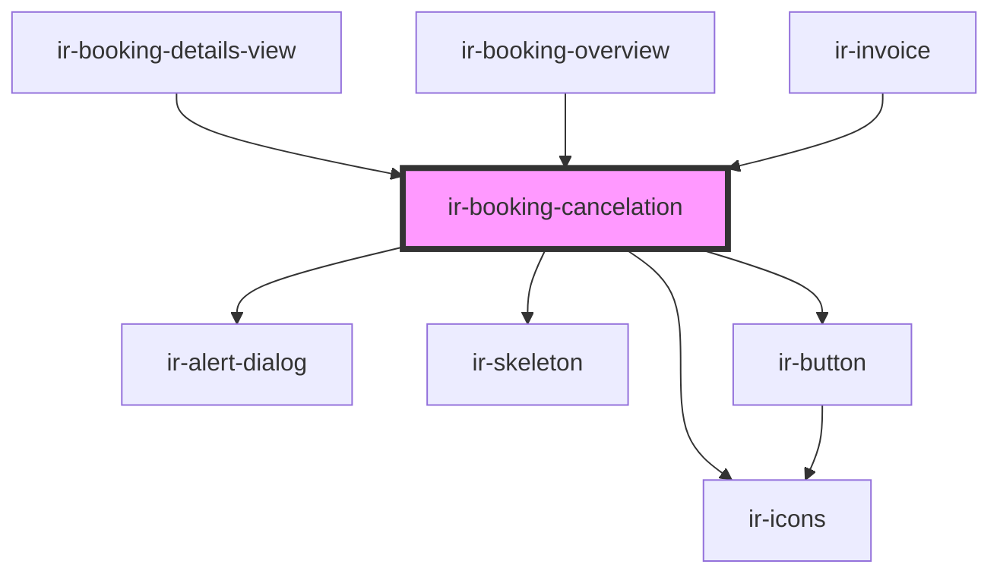

# ir-booking-cancelation

<!-- Auto Generated Below -->

## Properties

| Property               | Attribute     | Description | Type                            | Default     |
| ---------------------- | ------------- | ----------- | ------------------------------- | ----------- |
| `booking`              | --            |             | `Booking`                       | `undefined` |
| `booking_nbr`          | `booking_nbr` |             | `string`                        | `undefined` |
| `cancelation`          | `cancelation` |             | `string`                        | `undefined` |
| `cancelation_policies` | --            |             | `TBookingInfo[]`                | `[]`        |
| `currency`             | --            |             | `{ code: string; id: number; }` | `undefined` |

## Events

| Event               | Description | Type                                                                  |
| ------------------- | ----------- | --------------------------------------------------------------------- |
| `cancelationResult` |             | `CustomEvent<{ state: "success" \| "failed"; booking_nbr: string; }>` |
| `openChange`        |             | `CustomEvent<boolean>`                                                |

## Methods

### `openDialog() => Promise<void>`

#### Returns

Type: `Promise<void>`

## Dependencies

### Used by

 - [ir-booking-details-view](../ir-booking-engine/ir-booking-listing/ir-booking-details-view)
 - [ir-booking-overview](../ir-booking-engine/ir-booking-listing/ir-booking-overview)
 - [ir-invoice](../ir-invoice)

### Depends on

- [ir-alert-dialog](../ui/ir-alert-dialog)
- [ir-skeleton](../ui/ir-skeleton)
- [ir-icons](../ui/ir-icons)
- [ir-button](../ui/ir-button)

### Graph

----------------------------------------------

*Built with [StencilJS](https://stenciljs.com/)*
