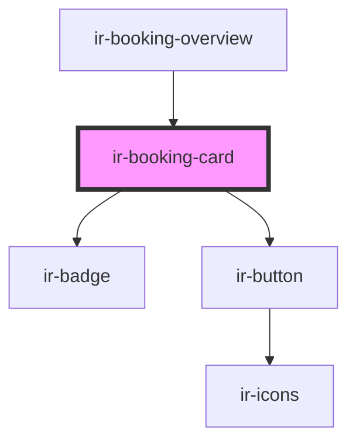

# ir-booking-card

<!-- Auto Generated Below -->

## Properties

| Property  | Attribute | Description | Type      | Default     |
| --------- | --------- | ----------- | --------- | ----------- |
| `aff`     | `aff`     |             | `boolean` | `false`     |
| `booking` | --        |             | `Booking` | `undefined` |

## Events

| Event           | Description | Type                                        |
| --------------- | ----------- | ------------------------------------------- |
| `optionClicked` |             | `CustomEvent<{ tag: string; id: number; }>` |

## Dependencies

### Used by

 - [ir-booking-overview](../ir-booking-overview)

### Depends on

- [ir-badge](../../../ui/ir-badge)
- [ir-button](../../../ui/ir-button)

### Graph

----------------------------------------------

*Built with [StencilJS](https://stenciljs.com/)*
