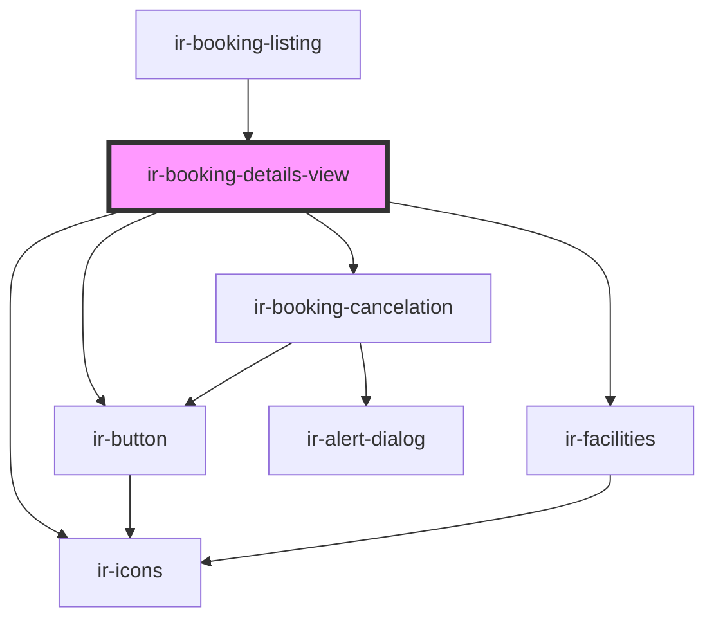

# ir-booking-details-view

<!-- Auto Generated Below -->

## Properties

| Property  | Attribute | Description | Type      | Default |
| --------- | --------- | ----------- | --------- | ------- |
| `booking` | --        |             | `Booking` | `null`  |

## Events

| Event        | Description | Type                                                                        |
| ------------ | ----------- | --------------------------------------------------------------------------- |
| `bl_routing` |             | `CustomEvent<{ route: "booking" \| "booking-details"; params?: unknown; }>` |

## Dependencies

### Used by

 - [ir-booking-listing](..)

### Depends on

- [ir-button](../../../ui/ir-button)
- [ir-icons](../../../ui/ir-icons)
- [ir-facilities](../../ir-booking-page/ir-facilities)
- [ir-booking-cancelation](../../../ir-booking-cancelation)

### Graph

----------------------------------------------

*Built with [StencilJS](https://stenciljs.com/)*
