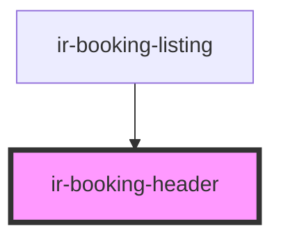

# ir-booking-header

<!-- Auto Generated Below -->

## Properties

| Property        | Attribute        | Description | Type                                | Default            |
| --------------- | ---------------- | ----------- | ----------------------------------- | ------------------ |
| `activeLink`    | `active-link`    |             | `"all_booking" \| "single_booking"` | `'single_booking'` |
| `bookingNumber` | `booking-number` |             | `number`                            | `null`             |
| `mode`          | `mode`           |             | `"multi" \| "single"`               | `'multi'`          |

## Events

| Event         | Description | Type                                             |
| ------------- | ----------- | ------------------------------------------------ |
| `linkChanged` |             | `CustomEvent<"all_booking" \| "single_booking">` |

## Dependencies

### Used by

 - [ir-booking-listing](..)

### Graph

----------------------------------------------

*Built with [StencilJS](https://stenciljs.com/)*
