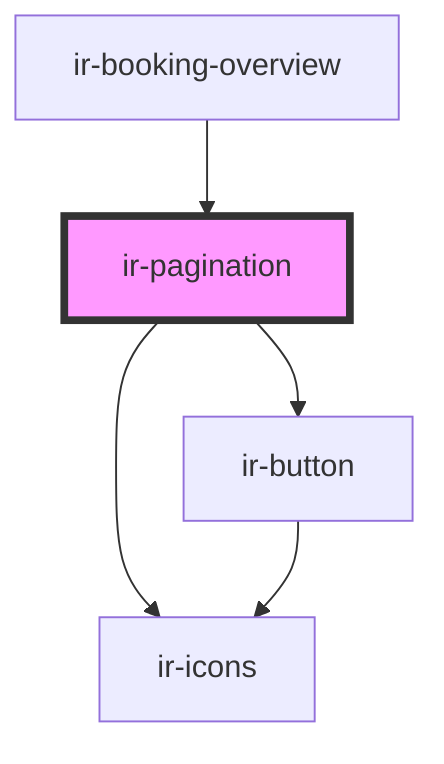

# ir-pagination

<!-- Auto Generated Below -->

## Properties

| Property       | Attribute        | Description | Type     | Default     |
| -------------- | ---------------- | ----------- | -------- | ----------- |
| `current`      | `current`        |             | `number` | `undefined` |
| `minPageShown` | `min-page-shown` |             | `number` | `7`         |
| `total`        | `total`          |             | `number` | `undefined` |

## Events

| Event        | Description | Type                  |
| ------------ | ----------- | --------------------- |
| `pageChange` |             | `CustomEvent<number>` |

## Dependencies

### Used by

 - [ir-booking-overview](../ir-booking-overview)

### Depends on

- [ir-button](../../../ui/ir-button)
- [ir-icons](../../../ui/ir-icons)

### Graph

----------------------------------------------

*Built with [StencilJS](https://stenciljs.com/)*
