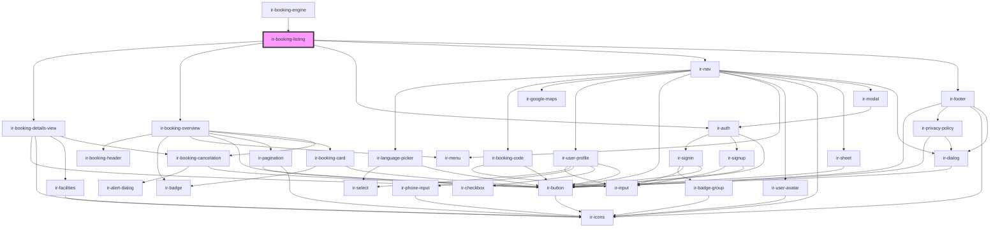

# ir-booking-listing

<!-- Auto Generated Below -->

## Properties

| Property          | Attribute           | Description | Type      | Default     |
| ----------------- | ------------------- | ----------- | --------- | ----------- |
| `aName`           | `a-name`            |             | `string`  | `null`      |
| `baseUrl`         | `base-url`          |             | `string`  | `undefined` |
| `be`              | `be`                |             | `boolean` | `false`     |
| `footerShown`     | `footer-shown`      |             | `boolean` | `true`      |
| `headerShown`     | `header-shown`      |             | `boolean` | `true`      |
| `language`        | `language`          |             | `string`  | `undefined` |
| `maxPages`        | `max-pages`         |             | `number`  | `10`        |
| `perma_link`      | `perma_link`        |             | `string`  | `null`      |
| `propertyid`      | `propertyid`        |             | `number`  | `undefined` |
| `showAllBookings` | `show-all-bookings` |             | `boolean` | `true`      |

## Dependencies

### Used by

 - [ir-booking-engine](..)

### Depends on

- [ir-booking-details-view](ir-booking-details-view)
- [ir-booking-overview](ir-booking-overview)
- [ir-auth](../ir-nav/ir-auth)
- [ir-nav](../ir-nav)
- [ir-footer](../ir-footer)

### Graph

----------------------------------------------

*Built with [StencilJS](https://stenciljs.com/)*
