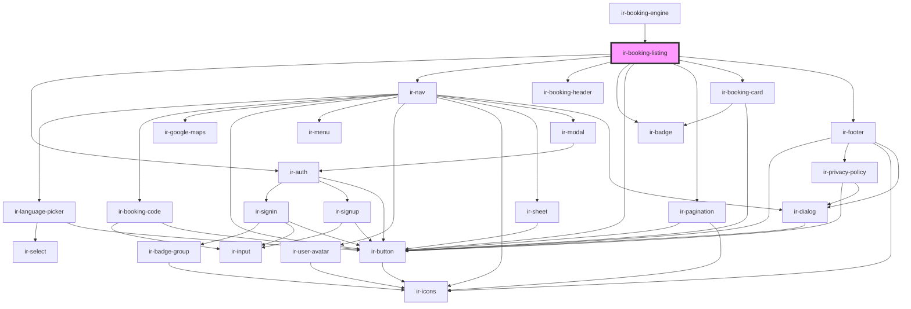

# ir-booking-listing

<!-- Auto Generated Below -->

## Properties

| Property      | Attribute      | Description | Type      | Default     |
| ------------- | -------------- | ----------- | --------- | ----------- |
| `aName`       | `a-name`       |             | `string`  | `null`      |
| `baseUrl`     | `base-url`     |             | `string`  | `undefined` |
| `footerShown` | `footer-shown` |             | `boolean` | `true`      |
| `headerShown` | `header-shown` |             | `boolean` | `true`      |
| `language`    | `language`     |             | `string`  | `undefined` |
| `maxPages`    | `max-pages`    |             | `number`  | `10`        |
| `perma_link`  | `perma_link`   |             | `string`  | `null`      |
| `propertyid`  | `propertyid`   |             | `number`  | `undefined` |

## Dependencies

### Used by

 - [ir-booking-engine](..)

### Depends on

- [ir-auth](../ir-nav/ir-auth)
- [ir-nav](../ir-nav)
- [ir-booking-header](ir-booking-header)
- [ir-badge](../../ui/ir-badge)
- [ir-button](../../ui/ir-button)
- [ir-pagination](ir-pagination)
- [ir-booking-card](ir-booking-card)
- [ir-footer](../ir-footer)

### Graph

----------------------------------------------

*Built with [StencilJS](https://stenciljs.com/)*
