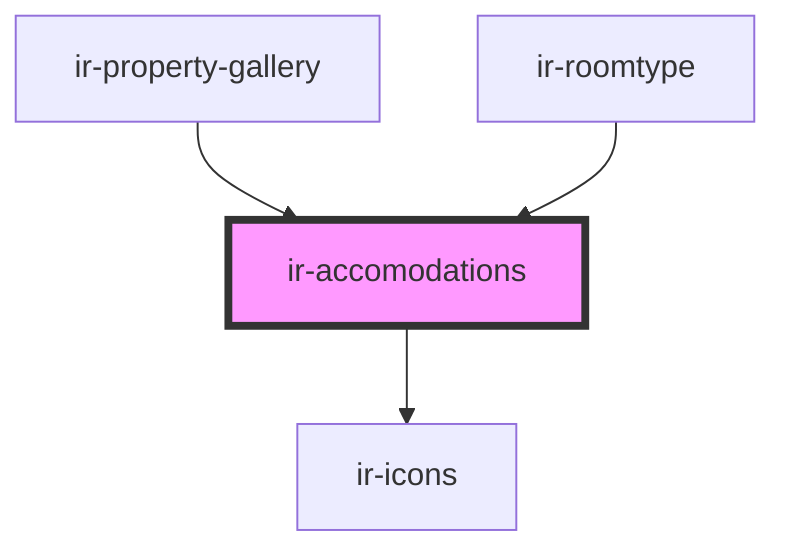

# ir-accomodations

<!-- Auto Generated Below -->

## Properties

| Property            | Attribute | Description | Type                                                        | Default     |
| ------------------- | --------- | ----------- | ----------------------------------------------------------- | ----------- |
| `amenities`         | --        |             | `Amenity[]`                                                 | `undefined` |
| `bookingAttributes` | --        |             | `{ max_occupancy: number; bedding_setup: BeddingSetup[]; }` | `undefined` |

## Dependencies

### Used by

 - [ir-property-gallery](../ir-property-gallery)
 - [ir-roomtype](../ir-roomtype)

### Depends on

- [ir-icons](../../../ui/ir-icons)

### Graph

----------------------------------------------

*Built with [StencilJS](https://stenciljs.com/)*
