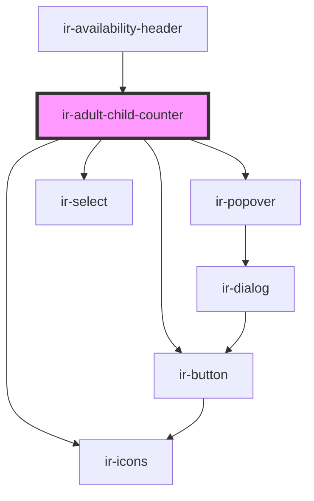

# ir-adult-child-counter

<!-- Auto Generated Below -->

## Properties

| Property           | Attribute            | Description | Type       | Default     |
| ------------------ | -------------------- | ----------- | ---------- | ----------- |
| `adultCount`       | `adult-count`        |             | `number`   | `2`         |
| `baseChildrenAges` | --                   |             | `string[]` | `[]`        |
| `childMaxAge`      | `child-max-age`      |             | `number`   | `0`         |
| `childrenCount`    | `children-count`     |             | `number`   | `0`         |
| `error`            | `error`              |             | `boolean`  | `undefined` |
| `infant_nbr`       | `infant_nbr`         |             | `number`   | `0`         |
| `maxAdultCount`    | `max-adult-count`    |             | `number`   | `10`        |
| `maxChildrenCount` | `max-children-count` |             | `number`   | `10`        |
| `minAdultCount`    | `min-adult-count`    |             | `number`   | `0`         |
| `minChildrenCount` | `min-children-count` |             | `number`   | `0`         |

## Events

| Event                  | Description | Type                                                                                                 |
| ---------------------- | ----------- | ---------------------------------------------------------------------------------------------------- |
| `addAdultsAndChildren` |             | `CustomEvent<{ adult_nbr: number; child_nbr: number; infant_nbr: number; childrenAges: string[]; }>` |
| `checkAvailability`    |             | `CustomEvent<null>`                                                                                  |

## Methods

### `open() => Promise<void>`

#### Returns

Type: `Promise<void>`

## Dependencies

### Used by

 - [ir-availability-header](../ir-availability-header)

### Depends on

- [ir-icons](../../../ui/ir-icons)
- [ir-popover](../../../ui/ir-popover)
- [ir-button](../../../ui/ir-button)
- [ir-select](../../../ui/ir-select)

### Graph

----------------------------------------------

*Built with [StencilJS](https://stenciljs.com/)*
