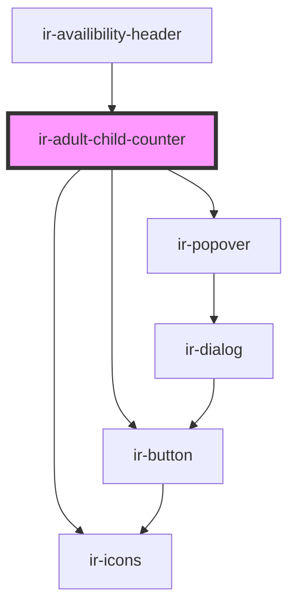

# ir-adult-child-counter

<!-- Auto Generated Below -->

## Properties

| Property           | Attribute            | Description | Type     | Default |
| ------------------ | -------------------- | ----------- | -------- | ------- |
| `adultCount`       | `adult-count`        |             | `number` | `0`     |
| `childMaxAge`      | `child-max-age`      |             | `number` | `0`     |
| `childrenCount`    | `children-count`     |             | `number` | `0`     |
| `maxAdultCount`    | `max-adult-count`    |             | `number` | `10`    |
| `maxChildrenCount` | `max-children-count` |             | `number` | `10`    |
| `minAdultCount`    | `min-adult-count`    |             | `number` | `0`     |
| `minChildrenCount` | `min-children-count` |             | `number` | `0`     |

## Events

| Event                  | Description | Type                                                     |
| ---------------------- | ----------- | -------------------------------------------------------- |
| `addAdultsAndChildren` |             | `CustomEvent<{ adult_nbr: number; child_nbr: number; }>` |

## Dependencies

### Used by

 - [ir-availibility-header](../ir-availibility-header)

### Depends on

- [ir-icons](../../../ui/ir-icons)
- [ir-popover](../../../ui/ir-popover)
- [ir-button](../../../ui/ir-button)

### Graph

----------------------------------------------

*Built with [StencilJS](https://stenciljs.com/)*
