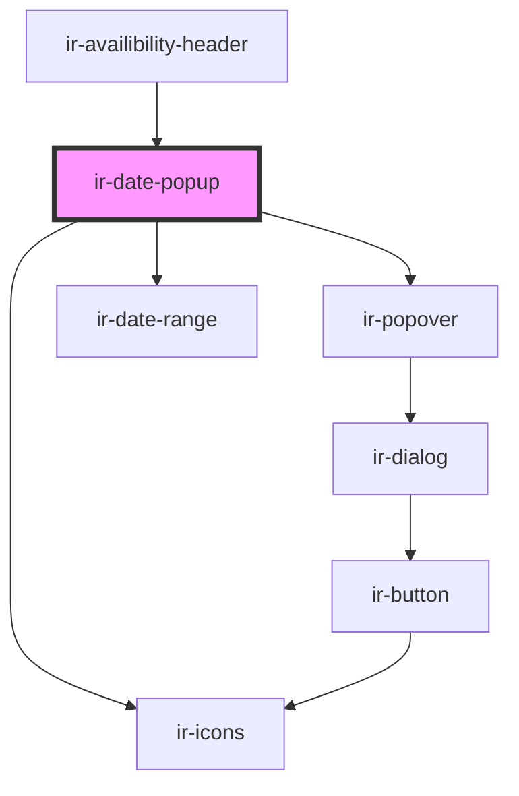

# ir-date-popup

<!-- Auto Generated Below -->

## Properties

| Property | Attribute | Description | Type                          | Default                                 |
| -------- | --------- | ----------- | ----------------------------- | --------------------------------------- |
| `dates`  | --        |             | `{ start: Date; end: Date; }` | `{     start: null,     end: null,   }` |

## Events

| Event        | Description | Type                                       |
| ------------ | ----------- | ------------------------------------------ |
| `dateChange` |             | `CustomEvent<{ start: Date; end: Date; }>` |

## Dependencies

### Used by

 - [ir-availibility-header](..)

### Depends on

- [ir-icons](../../../../ui/ir-icons)
- [ir-popover](../../../../ui/ir-popover)
- [ir-date-range](../../../../ui/ir-date-range)

### Graph

----------------------------------------------

*Built with [StencilJS](https://stenciljs.com/)*
