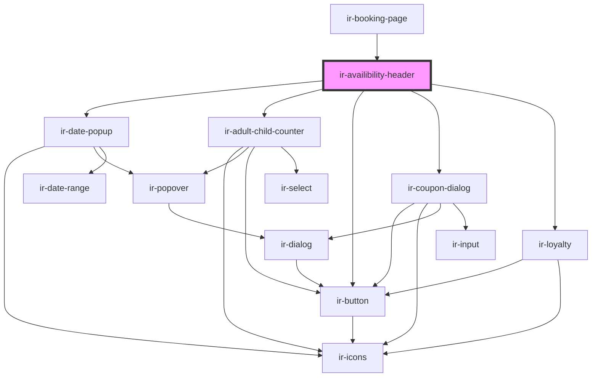

# ir-availibility-header

<!-- Auto Generated Below -->

## Properties

| Property        | Attribute        | Description | Type     | Default     |
| --------------- | ---------------- | ----------- | -------- | ----------- |
| `adultCount`    | `adult-count`    |             | `string` | `undefined` |
| `ages`          | `ages`           |             | `string` | `''`        |
| `childrenCount` | `children-count` |             | `string` | `undefined` |
| `fromDate`      | `from-date`      |             | `string` | `undefined` |
| `toDate`        | `to-date`        |             | `string` | `undefined` |

## Events

| Event              | Description | Type                |
| ------------------ | ----------- | ------------------- |
| `resetBooking`     |             | `CustomEvent<null>` |
| `scrollToRoomType` |             | `CustomEvent<null>` |

## Dependencies

### Used by

 - [ir-booking-page](..)

### Depends on

- [ir-date-popup](ir-date-popup)
- [ir-adult-child-counter](../ir-adult-child-counter)
- [ir-button](../../../ui/ir-button)
- [ir-coupon-dialog](ir-coupon-dialog)
- [ir-loyalty](ir-loyalty)

### Graph

----------------------------------------------

*Built with [StencilJS](https://stenciljs.com/)*
