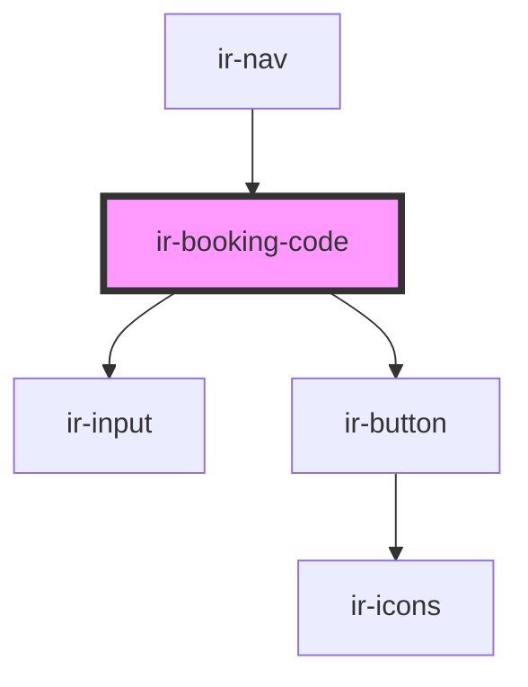

# ir-booking-code

<!-- Auto Generated Below -->

## Events

| Event          | Description | Type                  |
| -------------- | ----------- | --------------------- |
| `closeDialog`  |             | `CustomEvent<null>`   |
| `resetBooking` |             | `CustomEvent<string>` |

## Methods

### `clearAgent() => Promise<void>`

#### Returns

Type: `Promise<void>`

## Dependencies

### Used by

 - [ir-nav](../../ir-nav)

### Depends on

- [ir-input](../../../ui/ir-input)
- [ir-button](../../../ui/ir-button)

### Graph

----------------------------------------------

*Built with [StencilJS](https://stenciljs.com/)*
