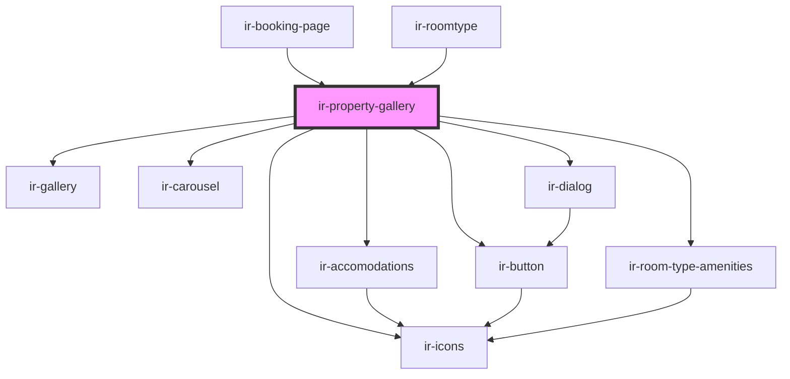

# ir-property-gallery

<!-- Auto Generated Below -->

## Properties

| Property         | Attribute        | Description | Type                      | Default     |
| ---------------- | ---------------- | ----------- | ------------------------- | ----------- |
| `property_state` | `property_state` |             | `"carousel" \| "gallery"` | `'gallery'` |
| `roomType`       | --               |             | `RoomType`                | `undefined` |

## Dependencies

### Used by

 - [ir-booking-page](..)
 - [ir-roomtype](../ir-roomtype)

### Depends on

- [ir-icons](../../../ui/ir-icons)
- [ir-gallery](../../../ui/ir-gallery)
- [ir-accomodations](../ir-accomodations)
- [ir-carousel](../../../ui/ir-carousel)
- [ir-button](../../../ui/ir-button)
- [ir-dialog](../../../ui/ir-dialog)
- [ir-room-type-amenities](../ir-room-type-amenities)

### Graph

----------------------------------------------

*Built with [StencilJS](https://stenciljs.com/)*
