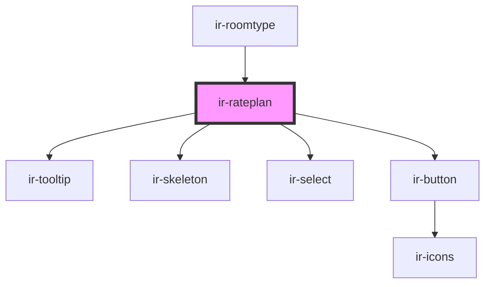

# ir-rateplan

<!-- Auto Generated Below -->

## Properties

| Property            | Attribute             | Description | Type                                                                                              | Default     |
| ------------------- | --------------------- | ----------- | ------------------------------------------------------------------------------------------------- | ----------- |
| `display`           | `display`             |             | `"default" \| "grid"`                                                                             | `'default'` |
| `ratePlan`          | --                    |             | `RatePlan`                                                                                        | `undefined` |
| `roomTypeId`        | `room-type-id`        |             | `number`                                                                                          | `undefined` |
| `roomTypeInventory` | `room-type-inventory` |             | `number`                                                                                          | `undefined` |
| `visibleInventory`  | --                    |             | `IRatePlanSelection \| { reserved: number; visibleInventory?: number; selected_variation: any; }` | `undefined` |

## Events

| Event                  | Description | Type                |
| ---------------------- | ----------- | ------------------- |
| `animateBookingButton` |             | `CustomEvent<null>` |

## Dependencies

### Used by

 - [ir-roomtype](../ir-roomtype)

### Depends on

- [ir-tooltip](../../../ui/ir-tooltip)
- [ir-skeleton](../../../ui/ir-skeleton)
- [ir-select](../../../ui/ir-select)
- [ir-button](../../../ui/ir-button)

### Graph

----------------------------------------------

*Built with [StencilJS](https://stenciljs.com/)*
