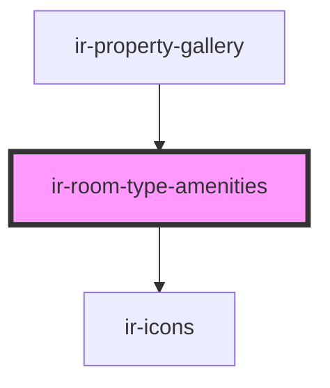

# ir-room-type-amenities

<!-- Auto Generated Below -->

## Properties

| Property    | Attribute | Description | Type        | Default     |
| ----------- | --------- | ----------- | ----------- | ----------- |
| `amenities` | --        |             | `Amenity[]` | `undefined` |
| `roomType`  | --        |             | `RoomType`  | `undefined` |

## Dependencies

### Used by

 - [ir-property-gallery](../ir-property-gallery)

### Depends on

- [ir-icons](../../../ui/ir-icons)

### Graph

----------------------------------------------

*Built with [StencilJS](https://stenciljs.com/)*
