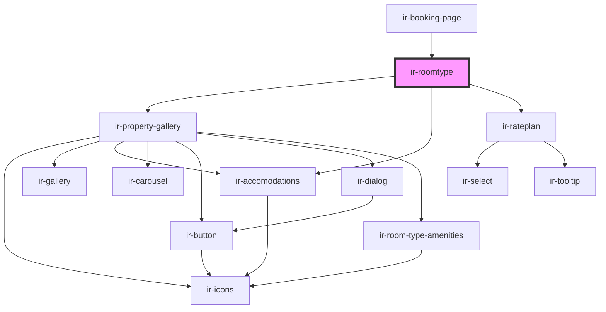

# ir-roomtype

<!-- Auto Generated Below -->

## Properties

| Property   | Attribute | Description | Type       | Default     |
| ---------- | --------- | ----------- | ---------- | ----------- |
| `roomtype` | --        |             | `RoomType` | `undefined` |

## Dependencies

### Used by

 - [ir-booking-page](..)

### Depends on

- [ir-property-gallery](../ir-property-gallery)
- [ir-accomodations](../ir-accomodations)
- [ir-rateplan](../ir-rateplan)

### Graph

----------------------------------------------

*Built with [StencilJS](https://stenciljs.com/)*
