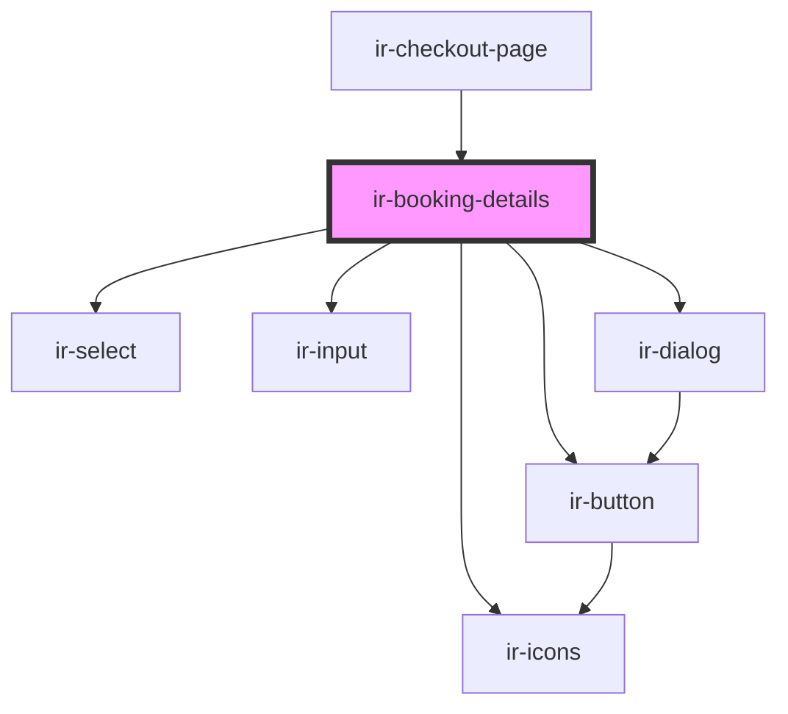

# ir-booking-details

<!-- Auto Generated Below -->

## Properties

| Property | Attribute | Description | Type     | Default     |
| -------- | --------- | ----------- | -------- | ----------- |
| `errors` | `errors`  |             | `string` | `undefined` |

## Dependencies

### Used by

 - [ir-checkout-page](..)

### Depends on

- [ir-icons](../../../ui/ir-icons)
- [ir-select](../../../ui/ir-select)
- [ir-button](../../../ui/ir-button)
- [ir-input](../../../ui/ir-input)
- [ir-dialog](../../../ui/ir-dialog)

### Graph

----------------------------------------------

*Built with [StencilJS](https://stenciljs.com/)*
