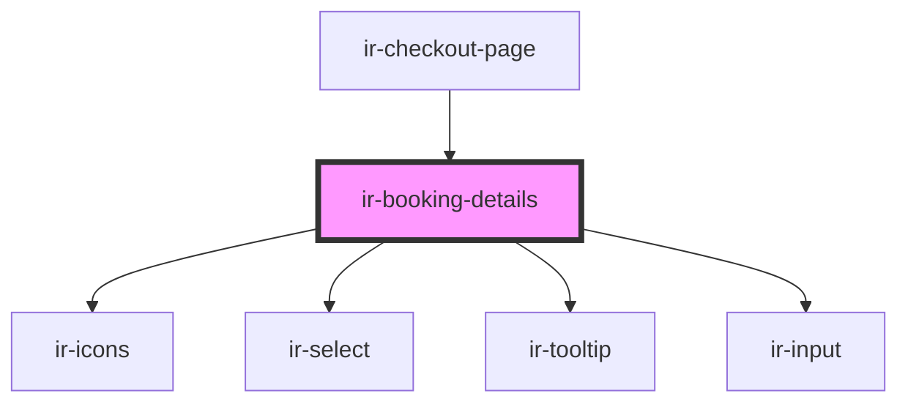

# ir-booking-details

<!-- Auto Generated Below -->

## Properties

| Property | Attribute | Description | Type     | Default     |
| -------- | --------- | ----------- | -------- | ----------- |
| `errors` | `errors`  |             | `string` | `undefined` |

## Events

| Event              | Description | Type                  |
| ------------------ | ----------- | --------------------- |
| `prepaymentChange` |             | `CustomEvent<number>` |

## Dependencies

### Used by

 - [ir-checkout-page](..)

### Depends on

- [ir-icons](../../../ui/ir-icons)
- [ir-select](../../../ui/ir-select)
- [ir-tooltip](../../../ui/ir-tooltip)
- [ir-input](../../../ui/ir-input)

### Graph

----------------------------------------------

*Built with [StencilJS](https://stenciljs.com/)*
