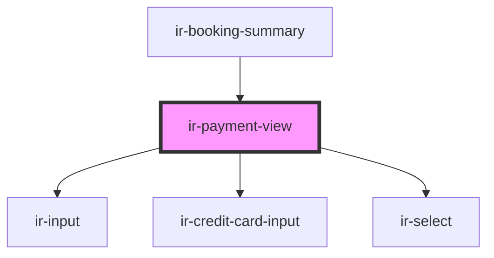

# ir-payment-view

<!-- Auto Generated Below -->

## Properties

| Property           | Attribute           | Description | Type                         | Default     |
| ------------------ | ------------------- | ----------- | ---------------------------- | ----------- |
| `errors`           | --                  |             | `{ [x: string]: ZodIssue; }` | `undefined` |
| `prepaymentAmount` | `prepayment-amount` |             | `number`                     | `0`         |

## Dependencies

### Used by

 - [ir-booking-summary](..)

### Depends on

- [ir-input](../../../../ui/ir-input)
- [ir-credit-card-input](../../ir-credit-card-input)
- [ir-select](../../../../ui/ir-select)

### Graph

----------------------------------------------

*Built with [StencilJS](https://stenciljs.com/)*
