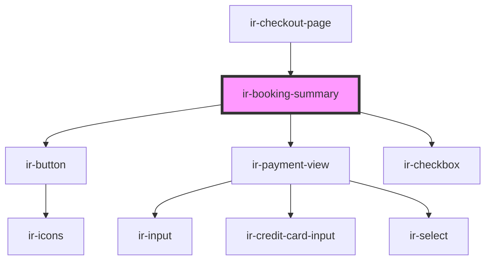

# ir-booking-summary

<!-- Auto Generated Below -->

## Properties

| Property           | Attribute           | Description | Type                                                                                                                                                  | Default     |
| ------------------ | ------------------- | ----------- | ----------------------------------------------------------------------------------------------------------------------------------------------------- | ----------- |
| `error`            | --                  |             | `{ cause: "booking-details" \| "booking-summary"; issues: string; } \| { cause: "user" \| "pickup" \| "payment"; issues: Record<string, ZodIssue>; }` | `undefined` |
| `prepaymentAmount` | `prepayment-amount` |             | `any`                                                                                                                                                 | `null`      |

## Events

| Event               | Description | Type                                                                                       |
| ------------------- | ----------- | ------------------------------------------------------------------------------------------ |
| `bookingClicked`    |             | `CustomEvent<null>`                                                                        |
| `openPrivacyPolicy` |             | `CustomEvent<null>`                                                                        |
| `routing`           |             | `CustomEvent<"booking" \| "booking-listing" \| "checkout" \| "invoice" \| "user-profile">` |

## Dependencies

### Used by

 - [ir-checkout-page](..)

### Depends on

- [ir-button](../../../ui/ir-button)
- [ir-payment-view](ir-payment-view)
- [ir-checkbox](../../../ui/ir-checkbox)

### Graph

----------------------------------------------

*Built with [StencilJS](https://stenciljs.com/)*
