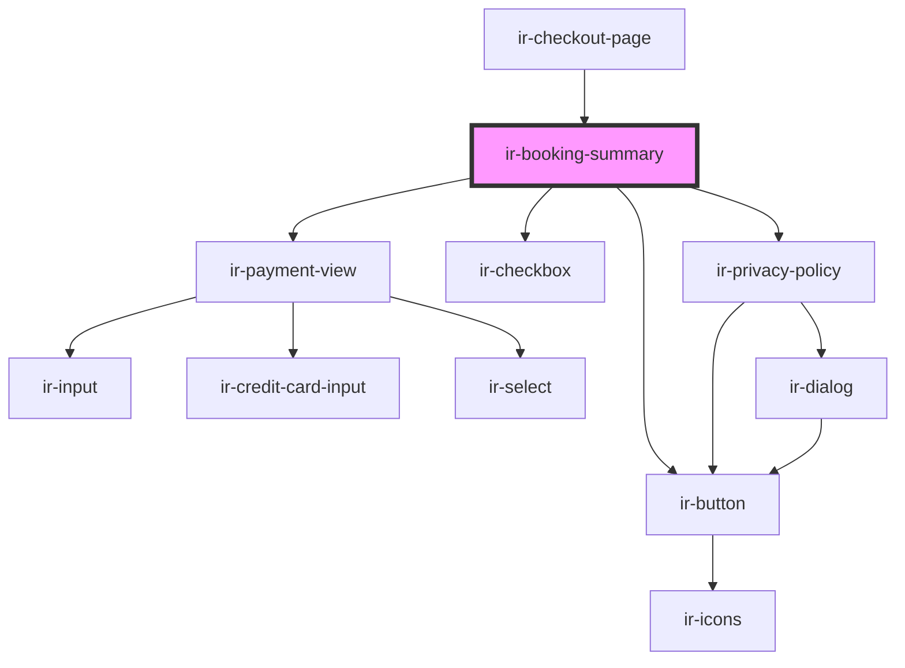

# ir-booking-summary

<!-- Auto Generated Below -->

## Properties

| Property    | Attribute    | Description | Type      | Default     |
| ----------- | ------------ | ----------- | --------- | ----------- |
| `error`     | `error`      |             | `boolean` | `undefined` |
| `isLoading` | `is-loading` |             | `boolean` | `false`     |

## Events

| Event            | Description | Type                                                                     |
| ---------------- | ----------- | ------------------------------------------------------------------------ |
| `bookingClicked` |             | `CustomEvent<null>`                                                      |
| `routing`        |             | `CustomEvent<"booking" \| "booking-listing" \| "checkout" \| "invoice">` |

## Dependencies

### Used by

 - [ir-checkout-page](..)

### Depends on

- [ir-button](../../../ui/ir-button)
- [ir-payment-view](ir-payment-view)
- [ir-checkbox](../../../ui/ir-checkbox)
- [ir-privacy-policy](../../ir-privacy-policy)

### Graph

----------------------------------------------

*Built with [StencilJS](https://stenciljs.com/)*
