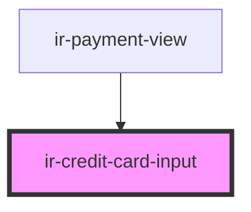

# ir-credit-card-input

<!-- Auto Generated Below -->

## Properties

| Property | Attribute | Description | Type     | Default     |
| -------- | --------- | ----------- | -------- | ----------- |
| `value`  | `value`   |             | `string` | `undefined` |

## Events

| Event              | Description | Type                                                                                |
| ------------------ | ----------- | ----------------------------------------------------------------------------------- |
| `creditCardChange` |             | `CustomEvent<{ value: string; cardType: "" \| "AMEX" \| "VISA" \| "Mastercard"; }>` |

## Dependencies

### Used by

 - [ir-payment-view](../ir-booking-summary/ir-payment-view)

### Graph

----------------------------------------------

*Built with [StencilJS](https://stenciljs.com/)*
