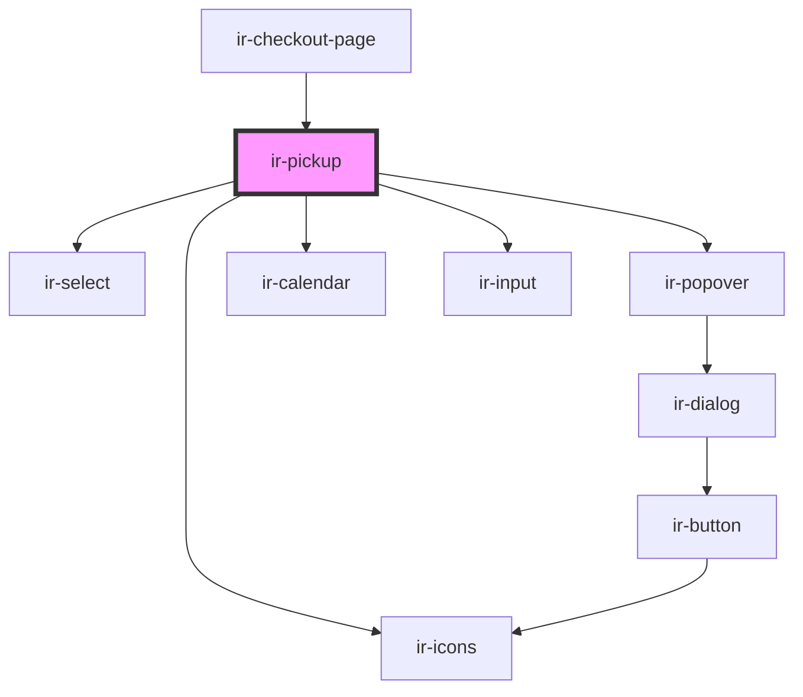

# ir-pickup

<!-- Auto Generated Below -->

## Properties

| Property | Attribute | Description | Type                         | Default     |
| -------- | --------- | ----------- | ---------------------------- | ----------- |
| `errors` | --        |             | `{ [x: string]: ZodIssue; }` | `undefined` |

## Dependencies

### Used by

 - [ir-checkout-page](..)

### Depends on

- [ir-icons](../../../ui/ir-icons)
- [ir-select](../../../ui/ir-select)
- [ir-popover](../../../ui/ir-popover)
- [ir-calendar](../../../ui/ir-calendar)
- [ir-input](../../../ui/ir-input)

### Graph

----------------------------------------------

*Built with [StencilJS](https://stenciljs.com/)*
