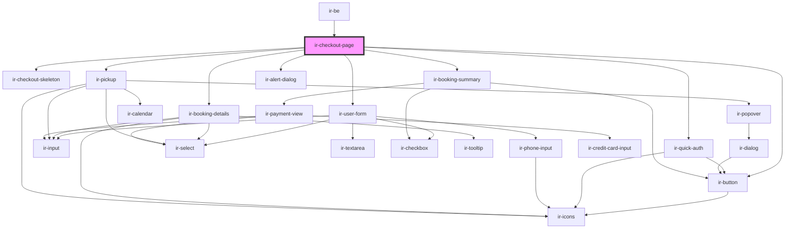

# ir-checkout-page

<!-- Auto Generated Below -->

## Events

| Event     | Description | Type                                                                                       |
| --------- | ----------- | ------------------------------------------------------------------------------------------ |
| `routing` |             | `CustomEvent<"booking" \| "booking-listing" \| "checkout" \| "invoice" \| "user-profile">` |

## Dependencies

### Used by

 - [ir-be](..)

### Depends on

- [ir-checkout-skeleton](ir-checkout-skeleton)
- [ir-button](../../ui/ir-button)
- [ir-quick-auth](./ir-user-form/ir-quick-auth)
- [ir-user-form](ir-user-form)
- [ir-booking-details](ir-booking-details)
- [ir-pickup](ir-pickup)
- [ir-booking-summary](ir-booking-summary)
- [ir-alert-dialog](../../ui/ir-alert-dialog)

### Graph

----------------------------------------------

*Built with [StencilJS](https://stenciljs.com/)*
