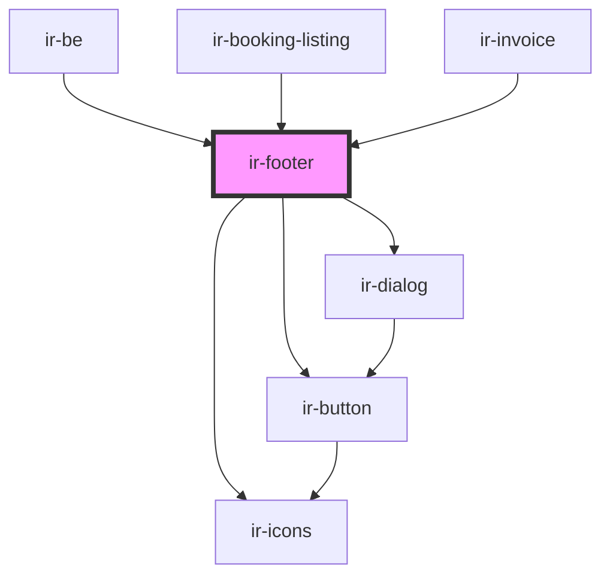

# ir-footer

<!-- Auto Generated Below -->

## Properties

| Property  | Attribute | Description | Type     | Default     |
| --------- | --------- | ----------- | -------- | ----------- |
| `version` | `version` |             | `string` | `undefined` |

## Events

| Event               | Description | Type                |
| ------------------- | ----------- | ------------------- |
| `openPrivacyPolicy` |             | `CustomEvent<null>` |

## Dependencies

### Used by

 - [ir-be](..)
 - [ir-booking-listing](../ir-booking-listing)
 - [ir-invoice](../../ir-invoice)

### Depends on

- [ir-button](../../ui/ir-button)
- [ir-icons](../../ui/ir-icons)
- [ir-dialog](../../ui/ir-dialog)

### Graph

----------------------------------------------

*Built with [StencilJS](https://stenciljs.com/)*
