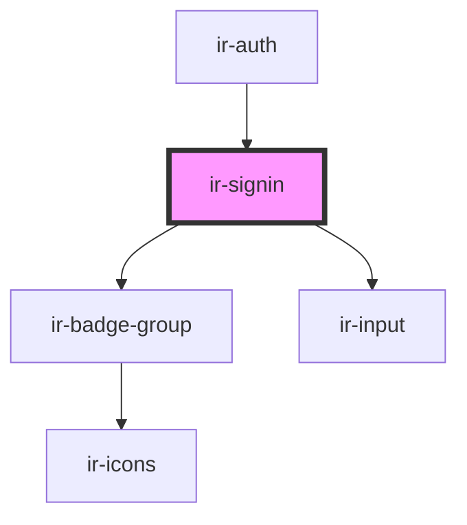

# ir-signin

<!-- Auto Generated Below -->

## Properties

| Property       | Attribute        | Description | Type      | Default |
| -------------- | ---------------- | ----------- | --------- | ------- |
| `enableSignUp` | `enable-sign-up` |             | `boolean` | `false` |

## Events

| Event        | Description | Type                                                                                                                                              |
| ------------ | ----------- | ------------------------------------------------------------------------------------------------------------------------------------------------- |
| `authFinish` |             | `CustomEvent<{ state: "success" \| "failed"; token: string; payload: { method: "google" \| "direct"; email?: string; booking_nbr?: string; }; }>` |
| `navigate`   |             | `CustomEvent<"login" \| "register">`                                                                                                              |
| `signIn`     |             | `CustomEvent<BeSignInTrigger \| FBTrigger \| GoogleTrigger>`                                                                                      |

## Dependencies

### Used by

 - [ir-auth](..)

### Depends on

- [ir-badge-group](../../../../ui/ir-badge-group)
- [ir-input](../../../../ui/ir-input)

### Graph

----------------------------------------------

*Built with [StencilJS](https://stenciljs.com/)*
