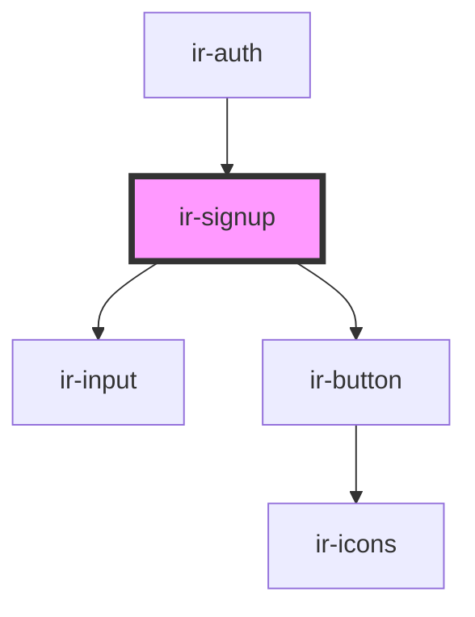

# ir-signup

<!-- Auto Generated Below -->

## Events

| Event      | Description | Type                                                         |
| ---------- | ----------- | ------------------------------------------------------------ |
| `navigate` |             | `CustomEvent<"login" \| "register">`                         |
| `signUp`   |             | `CustomEvent<BeSignUpTrigger \| FBTrigger \| GoogleTrigger>` |

## Dependencies

### Used by

 - [ir-auth](..)

### Depends on

- [ir-input](../../../../ui/ir-input)
- [ir-button](../../../../ui/ir-button)

### Graph

----------------------------------------------

*Built with [StencilJS](https://stenciljs.com/)*
