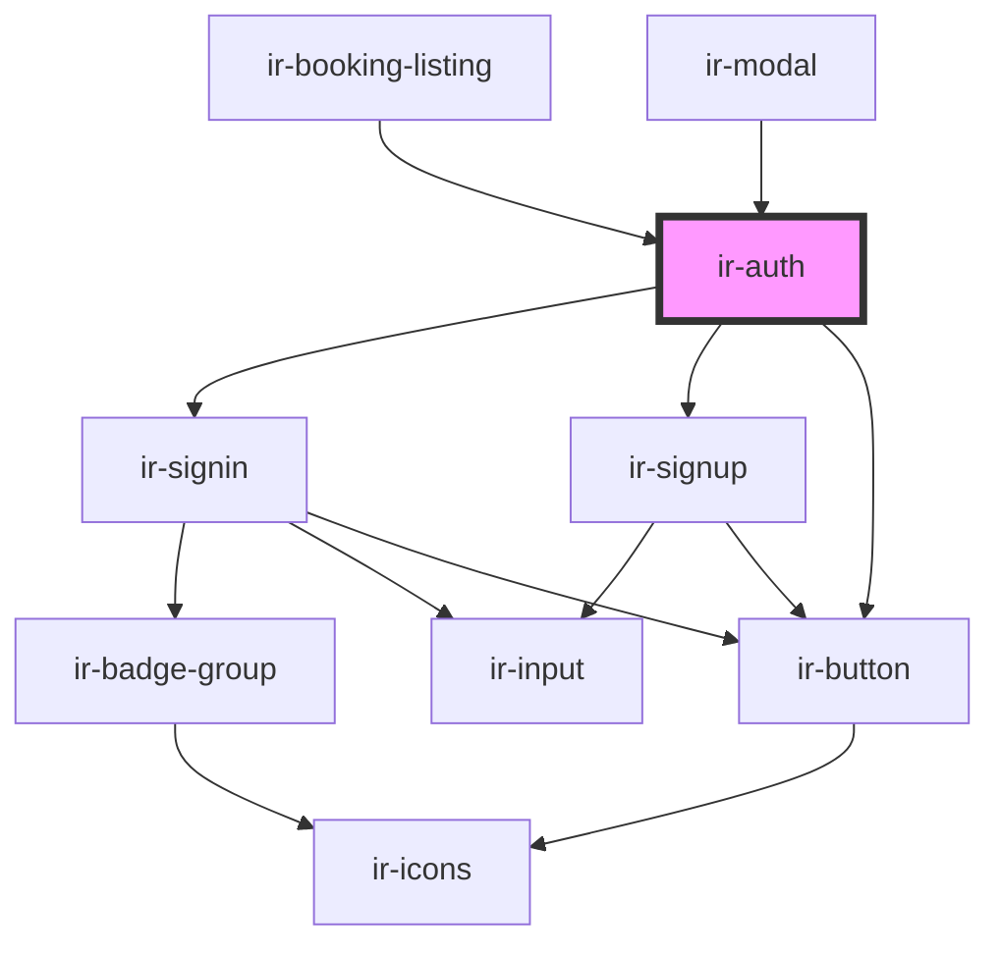

# ir-auth

<!-- Auto Generated Below -->

## Properties

| Property       | Attribute        | Description | Type      | Default |
| -------------- | ---------------- | ----------- | --------- | ------- |
| `enableSignUp` | `enable-sign-up` |             | `boolean` | `true`  |

## Events

| Event         | Description | Type                |
| ------------- | ----------- | ------------------- |
| `closeDialog` |             | `CustomEvent<null>` |

## Dependencies

### Used by

 - [ir-booking-listing](../../ir-booking-listing)
 - [ir-modal](../../../ui/ir-modal)

### Depends on

- [ir-signin](ir-signin)
- [ir-signup](ir-signup)
- [ir-button](../../../ui/ir-button)

### Graph

----------------------------------------------

*Built with [StencilJS](https://stenciljs.com/)*
