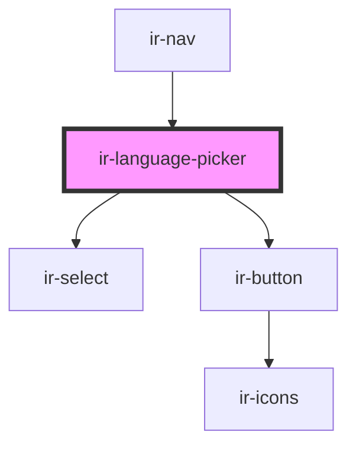

# ir-language-picker

<!-- Auto Generated Below -->

## Properties

| Property     | Attribute | Description | Type                  | Default     |
| ------------ | --------- | ----------- | --------------------- | ----------- |
| `currencies` | --        |             | `ICurrency[]`         | `undefined` |
| `languages`  | --        |             | `IExposedLanguages[]` | `undefined` |

## Events

| Event             | Description | Type                  |
| ----------------- | ----------- | --------------------- |
| `closeDialog`     |             | `CustomEvent<null>`   |
| `languageChanged` |             | `CustomEvent<string>` |
| `resetBooking`    |             | `CustomEvent<null>`   |

## Dependencies

### Used by

 - [ir-nav](..)

### Depends on

- [ir-select](../../../ui/ir-select)
- [ir-button](../../../ui/ir-button)

### Graph

----------------------------------------------

*Built with [StencilJS](https://stenciljs.com/)*
