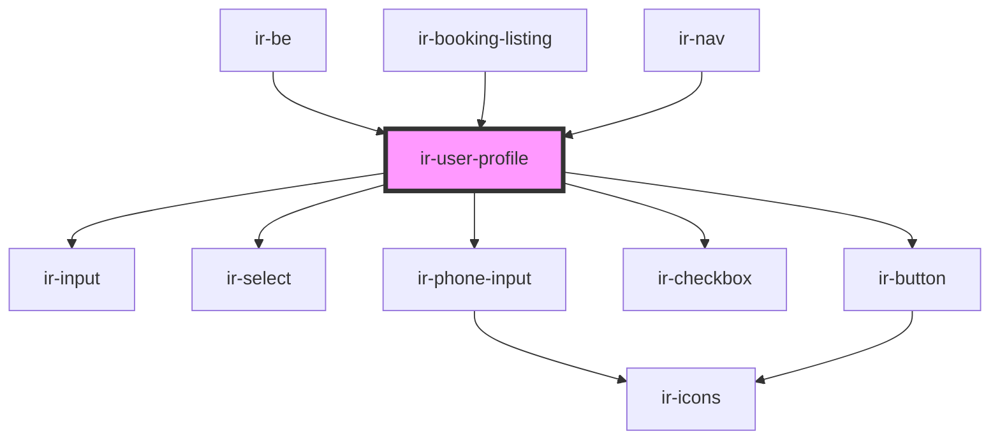

# ir-user-profile

<!-- Auto Generated Below -->

## Properties

| Property    | Attribute | Description | Type                                                                                                                                                                                                                                                            | Default |
| ----------- | --------- | ----------- | --------------------------------------------------------------------------------------------------------------------------------------------------------------------------------------------------------------------------------------------------------------- | ------- |
| `be`        | `be`      |             | `boolean`                                                                                                                                                                                                                                                       | `true`  |
| `user_data` | --        |             | `{ address?: string; id?: number; email?: string; country_id?: number; country_phone_prefix?: string; city?: string; dob?: string; first_name?: string; last_name?: string; mobile?: number; subscribe_to_news_letter?: boolean; alternative_email?: string; }` | `{}`    |

## Dependencies

### Used by

 - [ir-be](../..)
 - [ir-booking-listing](../../ir-booking-listing)
 - [ir-nav](..)

### Depends on

- [ir-input](../../../ui/ir-input)
- [ir-select](../../../ui/ir-select)
- [ir-phone-input](../../../ui/ir-phone-input)
- [ir-checkbox](../../../ui/ir-checkbox)
- [ir-button](../../../ui/ir-button)

### Graph

----------------------------------------------

*Built with [StencilJS](https://stenciljs.com/)*
