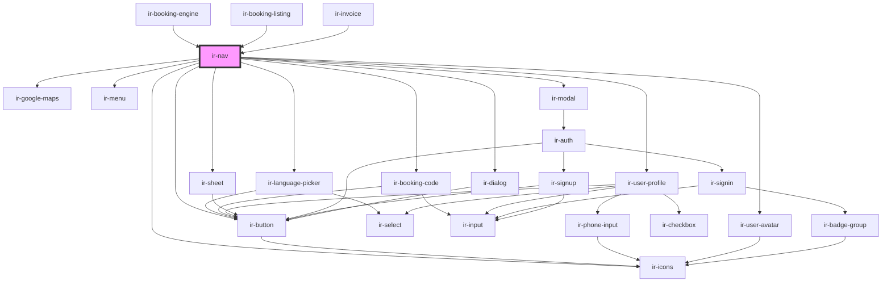

# ir-nav

<!-- Auto Generated Below -->

## Properties

| Property           | Attribute            | Description | Type                  | Default     |
| ------------------ | -------------------- | ----------- | --------------------- | ----------- |
| `currencies`       | --                   |             | `ICurrency[]`         | `undefined` |
| `isBookingListing` | `is-booking-listing` |             | `boolean`             | `false`     |
| `languages`        | --                   |             | `IExposedLanguages[]` | `undefined` |
| `logo`             | `logo`               |             | `string`              | `undefined` |
| `menuShown`        | `menu-shown`         |             | `boolean`             | `true`      |
| `showBookingCode`  | `show-booking-code`  |             | `boolean`             | `true`      |
| `showCurrency`     | `show-currency`      |             | `boolean`             | `true`      |
| `website`          | `website`            |             | `string`              | `undefined` |

## Events

| Event     | Description | Type                                                                                       |
| --------- | ----------- | ------------------------------------------------------------------------------------------ |
| `routing` |             | `CustomEvent<"booking" \| "booking-listing" \| "checkout" \| "invoice" \| "user-profile">` |

## Dependencies

### Used by

 - [ir-booking-engine](..)
 - [ir-booking-listing](../ir-booking-listing)
 - [ir-invoice](../../ir-invoice)

### Depends on

- [ir-language-picker](ir-language-picker)
- [ir-booking-code](../ir-booking-page/ir-booking-code)
- [ir-google-maps](../../ir-google-maps)
- [ir-user-profile](ir-user-profile)
- [ir-button](../../ui/ir-button)
- [ir-menu](../../ui/ir-menu)
- [ir-user-avatar](./ir-user-profile/ir-user-avatar)
- [ir-icons](../../ui/ir-icons)
- [ir-sheet](../../ui/ir-sheet)
- [ir-modal](../../ui/ir-modal)
- [ir-dialog](../../ui/ir-dialog)

### Graph

----------------------------------------------

*Built with [StencilJS](https://stenciljs.com/)*
