# ir-booking-engine

<!-- Auto Generated Below -->

## Properties

| Property        | Attribute        | Description | Type                                    | Default                                                                                                                                                                                                                                                                                                                                                                                                                                                                                                                                                                                                                                                                                                                                                                                                                               |
| --------------- | ---------------- | ----------- | --------------------------------------- | ------------------------------------------------------------------------------------------------------------------------------------------------------------------------------------------------------------------------------------------------------------------------------------------------------------------------------------------------------------------------------------------------------------------------------------------------------------------------------------------------------------------------------------------------------------------------------------------------------------------------------------------------------------------------------------------------------------------------------------------------------------------------------------------------------------------------------------- |
| `aName`         | `a-name`         |             | `string`                                | `null`                                                                                                                                                                                                                                                                                                                                                                                                                                                                                                                                                                                                                                                                                                                                                                                                                                |
| `adultCount`    | `adult-count`    |             | `string`                                | `undefined`                                                                                                                                                                                                                                                                                                                                                                                                                                                                                                                                                                                                                                                                                                                                                                                                                           |
| `aff`           | `aff`            |             | `string`                                | `undefined`                                                                                                                                                                                                                                                                                                                                                                                                                                                                                                                                                                                                                                                                                                                                                                                                                           |
| `baseUrl`       | `base-url`       |             | `string`                                | `undefined`                                                                                                                                                                                                                                                                                                                                                                                                                                                                                                                                                                                                                                                                                                                                                                                                                           |
| `childrenCount` | `children-count` |             | `string`                                | `undefined`                                                                                                                                                                                                                                                                                                                                                                                                                                                                                                                                                                                                                                                                                                                                                                                                                           |
| `cur`           | `cur`            |             | `string`                                | `undefined`                                                                                                                                                                                                                                                                                                                                                                                                                                                                                                                                                                                                                                                                                                                                                                                                                           |
| `fromDate`      | `from-date`      |             | `string`                                | `undefined`                                                                                                                                                                                                                                                                                                                                                                                                                                                                                                                                                                                                                                                                                                                                                                                                                           |
| `injected`      | `injected`       |             | `boolean`                               | `undefined`                                                                                                                                                                                                                                                                                                                                                                                                                                                                                                                                                                                                                                                                                                                                                                                                                           |
| `language`      | `language`       |             | `string`                                | `undefined`                                                                                                                                                                                                                                                                                                                                                                                                                                                                                                                                                                                                                                                                                                                                                                                                                           |
| `perma_link`    | `perma_link`     |             | `string`                                | `null`                                                                                                                                                                                                                                                                                                                                                                                                                                                                                                                                                                                                                                                                                                                                                                                                                                |
| `propertyId`    | `property-id`    |             | `number`                                | `undefined`                                                                                                                                                                                                                                                                                                                                                                                                                                                                                                                                                                                                                                                                                                                                                                                                                           |
| `redirect_url`  | `redirect_url`   |             | `string`                                | `null`                                                                                                                                                                                                                                                                                                                                                                                                                                                                                                                                                                                                                                                                                                                                                                                                                                |
| `roomtype_id`   | `roomtype_id`    |             | `number`                                | `null`                                                                                                                                                                                                                                                                                                                                                                                                                                                                                                                                                                                                                                                                                                                                                                                                                                |
| `source`        | --               |             | `{ code: string; desciption: string; }` | `null`                                                                                                                                                                                                                                                                                                                                                                                                                                                                                                                                                                                                                                                                                                                                                                                                                                |
| `stag`          | `stag`           |             | `string`                                | `undefined`                                                                                                                                                                                                                                                                                                                                                                                                                                                                                                                                                                                                                                                                                                                                                                                                                           |
| `toDate`        | `to-date`        |             | `string`                                | `undefined`                                                                                                                                                                                                                                                                                                                                                                                                                                                                                                                                                                                                                                                                                                                                                                                                                           |
| `token`         | `token`          |             | `string`                                | `'eyJ0eXAiOiJKV1QiLCJhbGciOiJIUzI1NiJ9.eyJleHAiOjE3MTQ1NTQ5OTIsIkNMQUlNLTAxIjoiOGJpaUdjK21FQVE9IiwiQ0xBSU0tMDIiOiI5UStMQm93VTl6az0iLCJDTEFJTS0wMyI6Ilp3Tys5azJoTzUwPSIsIkNMQUlNLTA0IjoicUxHWllZcVA3SzB5aENrRTFaY0tENm5TeFowNkEvQ2lPc1JrWUpYTHFhTEF5M3N0akltbU9CWkdDb080dDRyNVRiWjkxYnZQelFIQ2c1YlBGU2J3cm5HdjNsNjVVcjVLT3RnMmZQVWFnNHNEYmE3WTJkMDF4RGpDWUs2SFlGREhkcTFYTzBLdTVtd0NKeU5rWDFSeWZmSnhJdWdtZFBUeTZPWjk0RUVjYTJleWVSVzZFa0pYMnhCZzFNdnJ3aFRKRHF1cUxzaUxvZ3I0UFU5Y2x0MjdnQ2tJZlJzZ2lZbnpOK2szclZnTUdsQTUvWjRHekJWcHl3a0dqcWlpa0M5T0owWFUrdWJJM1dzNmNvSWEwSks4SWRqVjVaQ1VaZjZ1OGhBMytCUlpsUWlyWmFZVWZlVmpzU1FETFNwWFowYjVQY0FncE1EWVpmRGtWbGFscjRzZ1pRNVkwODkwcEp6dE16T0s2VTR5Z1FMQkdQbTlTSmRLY0ExSGU2MXl2YlhuIiwiQ0xBSU0tMDUiOiJFQTEzejA3ejBUcWRkM2gwNElyYThBcklIUzg2aEpCQSJ9.ySJjLhWwUDeP4X8LIJcbsjO74y_UgMHwRDpNrCClndc'` |

## Dependencies

### Depends on

- [ir-booking-page](ir-booking-page)
- [ir-checkout-page](ir-checkout-page)
- [ir-invoice](../ir-invoice)
- [ir-booking-listing](ir-booking-listing)
- [ir-user-profile](./ir-nav/ir-user-profile)
- [ir-interceptor](../ir-interceptor)
- [ir-nav](ir-nav)
- [ir-footer](ir-footer)

### Graph

```mermaid
graph TD;
  ir-booking-engine --> ir-booking-page
  ir-booking-engine --> ir-checkout-page
  ir-booking-engine --> ir-invoice
  ir-booking-engine --> ir-booking-listing
  ir-booking-engine --> ir-user-profile
  ir-booking-engine --> ir-interceptor
  ir-booking-engine --> ir-nav
  ir-booking-engine --> ir-footer
  ir-booking-page --> ir-property-gallery
  ir-booking-page --> ir-availibility-header
  ir-booking-page --> ir-roomtype
  ir-booking-page --> ir-facilities
  ir-booking-page --> ir-button
  ir-property-gallery --> ir-icons
  ir-property-gallery --> ir-gallery
  ir-property-gallery --> ir-accomodations
  ir-property-gallery --> ir-carousel
  ir-property-gallery --> ir-button
  ir-property-gallery --> ir-dialog
  ir-property-gallery --> ir-room-type-amenities
  ir-accomodations --> ir-icons
  ir-button --> ir-icons
  ir-dialog --> ir-button
  ir-room-type-amenities --> ir-icons
  ir-availibility-header --> ir-date-popup
  ir-availibility-header --> ir-adult-child-counter
  ir-availibility-header --> ir-button
  ir-availibility-header --> ir-coupon-dialog
  ir-availibility-header --> ir-loyalty
  ir-date-popup --> ir-icons
  ir-date-popup --> ir-popover
  ir-date-popup --> ir-date-range
  ir-popover --> ir-dialog
  ir-adult-child-counter --> ir-icons
  ir-adult-child-counter --> ir-popover
  ir-adult-child-counter --> ir-button
  ir-coupon-dialog --> ir-button
  ir-coupon-dialog --> ir-icons
  ir-coupon-dialog --> ir-dialog
  ir-coupon-dialog --> ir-input
  ir-loyalty --> ir-button
  ir-loyalty --> ir-icons
  ir-roomtype --> ir-property-gallery
  ir-roomtype --> ir-accomodations
  ir-roomtype --> ir-rateplan
  ir-rateplan --> ir-select
  ir-rateplan --> ir-tooltip
  ir-facilities --> ir-icons
  ir-checkout-page --> ir-checkout-skeleton
  ir-checkout-page --> ir-button
  ir-checkout-page --> ir-quick-auth
  ir-checkout-page --> ir-user-form
  ir-checkout-page --> ir-booking-details
  ir-checkout-page --> ir-pickup
  ir-checkout-page --> ir-booking-summary
  ir-quick-auth --> ir-icons
  ir-quick-auth --> ir-button
  ir-user-form --> ir-input
  ir-user-form --> ir-phone-input
  ir-user-form --> ir-select
  ir-user-form --> ir-textarea
  ir-user-form --> ir-checkbox
  ir-phone-input --> ir-icons
  ir-booking-details --> ir-icons
  ir-booking-details --> ir-select
  ir-booking-details --> ir-button
  ir-booking-details --> ir-input
  ir-booking-details --> ir-dialog
  ir-pickup --> ir-icons
  ir-pickup --> ir-select
  ir-pickup --> ir-popover
  ir-pickup --> ir-calendar
  ir-pickup --> ir-input
  ir-booking-summary --> ir-button
  ir-booking-summary --> ir-payment-view
  ir-booking-summary --> ir-checkbox
  ir-booking-summary --> ir-privacy-policy
  ir-payment-view --> ir-input
  ir-payment-view --> ir-credit-card-input
  ir-payment-view --> ir-select
  ir-privacy-policy --> ir-button
  ir-privacy-policy --> ir-dialog
  ir-invoice --> ir-interceptor
  ir-invoice --> ir-nav
  ir-invoice --> ir-button
  ir-invoice --> ir-icons
  ir-invoice --> ir-footer
  ir-invoice --> ir-alert-dialog
  ir-nav --> ir-language-picker
  ir-nav --> ir-booking-code
  ir-nav --> ir-google-maps
  ir-nav --> ir-user-profile
  ir-nav --> ir-button
  ir-nav --> ir-menu
  ir-nav --> ir-user-avatar
  ir-nav --> ir-icons
  ir-nav --> ir-sheet
  ir-nav --> ir-modal
  ir-nav --> ir-dialog
  ir-language-picker --> ir-select
  ir-language-picker --> ir-button
  ir-booking-code --> ir-input
  ir-booking-code --> ir-button
  ir-user-profile --> ir-input
  ir-user-profile --> ir-select
  ir-user-profile --> ir-phone-input
  ir-user-profile --> ir-checkbox
  ir-user-profile --> ir-button
  ir-user-avatar --> ir-icons
  ir-sheet --> ir-button
  ir-modal --> ir-auth
  ir-auth --> ir-signin
  ir-auth --> ir-signup
  ir-auth --> ir-button
  ir-signin --> ir-badge-group
  ir-signin --> ir-input
  ir-badge-group --> ir-icons
  ir-signup --> ir-input
  ir-signup --> ir-button
  ir-footer --> ir-button
  ir-footer --> ir-privacy-policy
  ir-footer --> ir-icons
  ir-footer --> ir-dialog
  ir-booking-listing --> ir-button
  ir-booking-listing --> ir-invoice
  ir-booking-listing --> ir-booking-overview
  ir-booking-listing --> ir-auth
  ir-booking-listing --> ir-nav
  ir-booking-listing --> ir-footer
  ir-booking-overview --> ir-booking-header
  ir-booking-overview --> ir-badge
  ir-booking-overview --> ir-menu
  ir-booking-overview --> ir-pagination
  ir-booking-overview --> ir-booking-card
  ir-booking-overview --> ir-booking-cancelation
  ir-pagination --> ir-button
  ir-pagination --> ir-icons
  ir-booking-card --> ir-badge
  ir-booking-card --> ir-button
  ir-booking-cancelation --> ir-alert-dialog
  ir-booking-cancelation --> ir-button
  style ir-booking-engine fill:#f9f,stroke:#333,stroke-width:4px
```

----------------------------------------------

*Built with [StencilJS](https://stenciljs.com/)*
