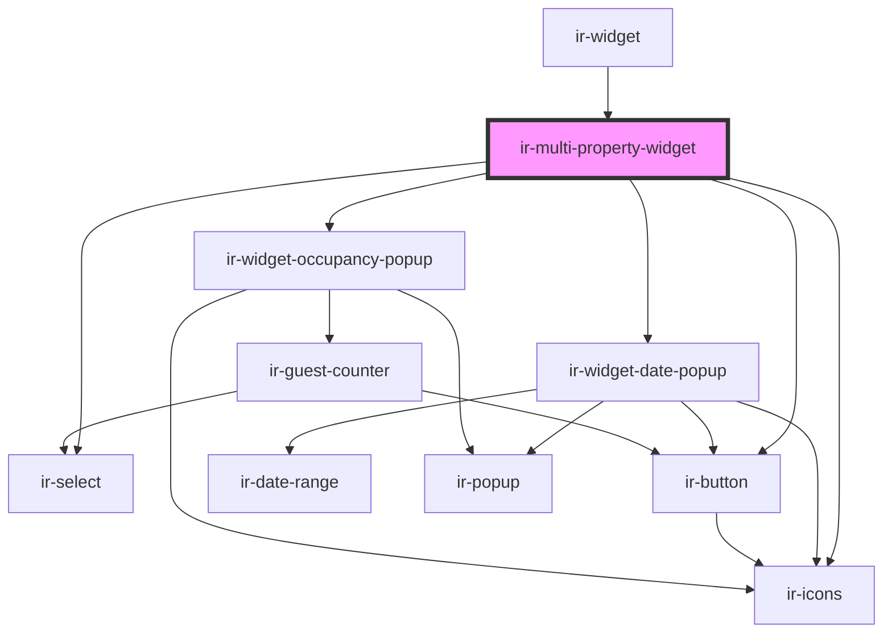

# ir-multi-property-widget

<!-- Auto Generated Below -->

## Properties

| Property             | Attribute              | Description | Type                                                                                      | Default     |
| -------------------- | ---------------------- | ----------- | ----------------------------------------------------------------------------------------- | ----------- |
| `dateModifiers`      | `date-modifiers`       |             | `any`                                                                                     | `undefined` |
| `dates`              | --                     |             | `{ from_date: Date; to_date: Date; }`                                                     | `undefined` |
| `error`              | `error`                |             | `boolean`                                                                                 | `undefined` |
| `guests`             | --                     |             | `{ adultCount: number; childrenCount: number; infants: number; childrenAges: string[]; }` | `undefined` |
| `isFetchingProperty` | `is-fetching-property` |             | `boolean`                                                                                 | `undefined` |
| `level2Properties`   | --                     |             | `{ cities: string[]; properties: Map<string, PropertiesByLevel2Response[]>; }`            | `undefined` |
| `linkedProperties`   | --                     |             | `IExposedProperty[]`                                                                      | `[]`        |
| `locale`             | `locale`               |             | `string`                                                                                  | `undefined` |
| `locations`          | --                     |             | `string[]`                                                                                | `undefined` |
| `position`           | `position`             |             | `string`                                                                                  | `undefined` |
| `property`           | --                     |             | `IExposedProperty`                                                                        | `undefined` |
| `selectedCity`       | `selected-city`        |             | `string`                                                                                  | `undefined` |
| `selectedPropertyId` | `selected-property-id` |             | `number \| string`                                                                        | `undefined` |

## Events

| Event            | Description | Type                                                                                                   |
| ---------------- | ----------- | ------------------------------------------------------------------------------------------------------ |
| `bookNow`        |             | `CustomEvent<void>`                                                                                    |
| `cityChange`     |             | `CustomEvent<string>`                                                                                  |
| `dateChange`     |             | `CustomEvent<{ from_date: Date; to_date: Date; }>`                                                     |
| `guestsChange`   |             | `CustomEvent<{ adultCount: number; childrenCount: number; infants: number; childrenAges: string[]; }>` |
| `propertyChange` |             | `CustomEvent<number \| string>`                                                                        |

## Shadow Parts

| Part                | Description |
| ------------------- | ----------- |
| `"container"`       |             |
| `"cta"`             |             |
| `"property-select"` |             |

## Dependencies

### Used by

 - [ir-widget](..)

### Depends on

- [ir-select](../../ui/ir-select)
- [ir-icons](../../ui/ir-icons)
- [ir-widget-date-popup](../ir-widget-date-popup)
- [ir-widget-occupancy-popup](../ir-widget-occupancy-popup)
- [ir-button](../../ui/ir-button)

### Graph

----------------------------------------------

*Built with [StencilJS](https://stenciljs.com/)*
