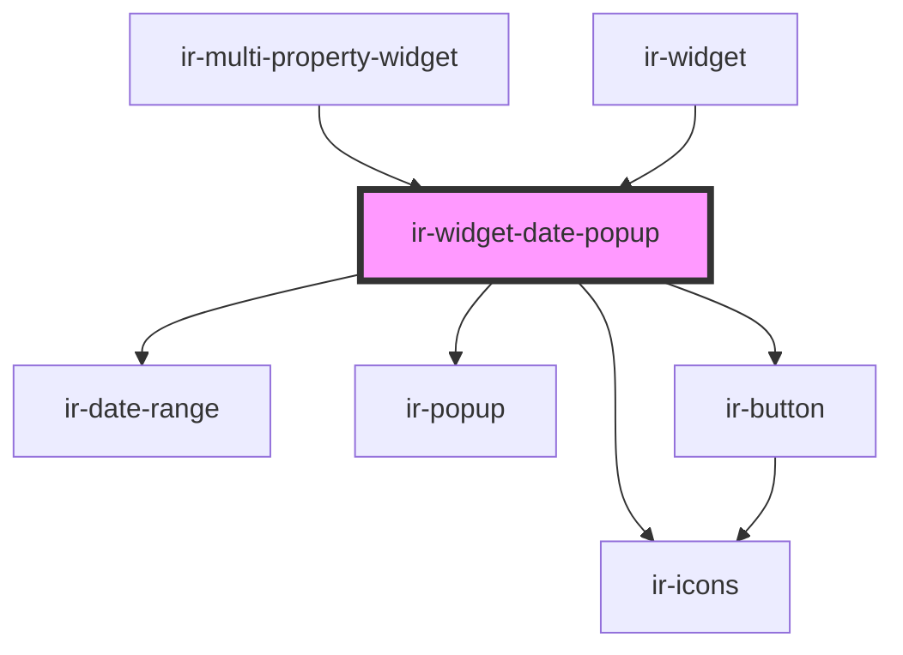

# ir-widget-date-popup

<!-- Auto Generated Below -->

## Properties

| Property        | Attribute        | Description | Type                                  | Default     |
| --------------- | ---------------- | ----------- | ------------------------------------- | ----------- |
| `absoluteIcon`  | `absolute-icon`  |             | `boolean`                             | `false`     |
| `dateModifiers` | `date-modifiers` |             | `any`                                 | `undefined` |
| `dates`         | --               |             | `{ from_date: Date; to_date: Date; }` | `undefined` |
| `disabled`      | `disabled`       |             | `boolean`                             | `undefined` |
| `isLoading`     | `is-loading`     |             | `boolean`                             | `undefined` |
| `locale`        | `locale`         |             | `string`                              | `undefined` |
| `maxSpanDays`   | `max-span-days`  |             | `number`                              | `undefined` |

## Events

| Event        | Description | Type                                               |
| ------------ | ----------- | -------------------------------------------------- |
| `dateChange` |             | `CustomEvent<{ from_date: Date; to_date: Date; }>` |

## Shadow Parts

| Part             | Description |
| ---------------- | ----------- |
| `"date-trigger"` |             |

## Dependencies

### Used by

 - [ir-multi-property-widget](../ir-multi-property-widget)
 - [ir-widget](..)

### Depends on

- [ir-icons](../../ui/ir-icons)
- [ir-date-range](../../ui/ir-date-range)
- [ir-popup](../../ui/ir-popup)
- [ir-button](../../ui/ir-button)

### Graph

----------------------------------------------

*Built with [StencilJS](https://stenciljs.com/)*
