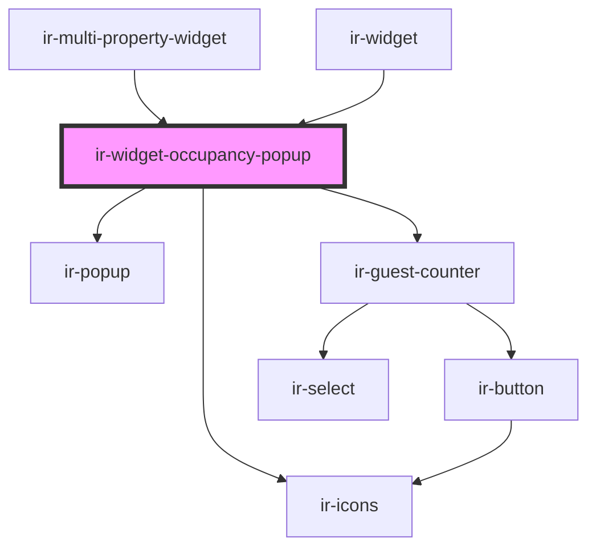

# ir-widget-occupancy-popup

<!-- Auto Generated Below -->

## Properties

| Property       | Attribute       | Description | Type                                                                                      | Default     |
| -------------- | --------------- | ----------- | ----------------------------------------------------------------------------------------- | ----------- |
| `absoluteIcon` | `absolute-icon` |             | `boolean`                                                                                 | `false`     |
| `disabled`     | `disabled`      |             | `boolean`                                                                                 | `undefined` |
| `error`        | `error`         |             | `boolean`                                                                                 | `undefined` |
| `guests`       | --              |             | `{ adultCount: number; childrenCount: number; infants: number; childrenAges: string[]; }` | `undefined` |
| `isLoading`    | `is-loading`    |             | `boolean`                                                                                 | `undefined` |
| `property`     | --              |             | `IExposedProperty`                                                                        | `undefined` |

## Events

| Event          | Description | Type                                                                                                   |
| -------------- | ----------- | ------------------------------------------------------------------------------------------------------ |
| `guestsChange` |             | `CustomEvent<{ adultCount: number; childrenCount: number; infants: number; childrenAges: string[]; }>` |

## Shadow Parts

| Part               | Description |
| ------------------ | ----------- |
| `"guest-counter"`  |             |
| `"guests-trigger"` |             |

## Dependencies

### Used by

 - [ir-multi-property-widget](../ir-multi-property-widget)
 - [ir-widget](..)

### Depends on

- [ir-icons](../../ui/ir-icons)
- [ir-popup](../../ui/ir-popup)
- [ir-guest-counter](../../ir-guest-counter)

### Graph

----------------------------------------------

*Built with [StencilJS](https://stenciljs.com/)*
