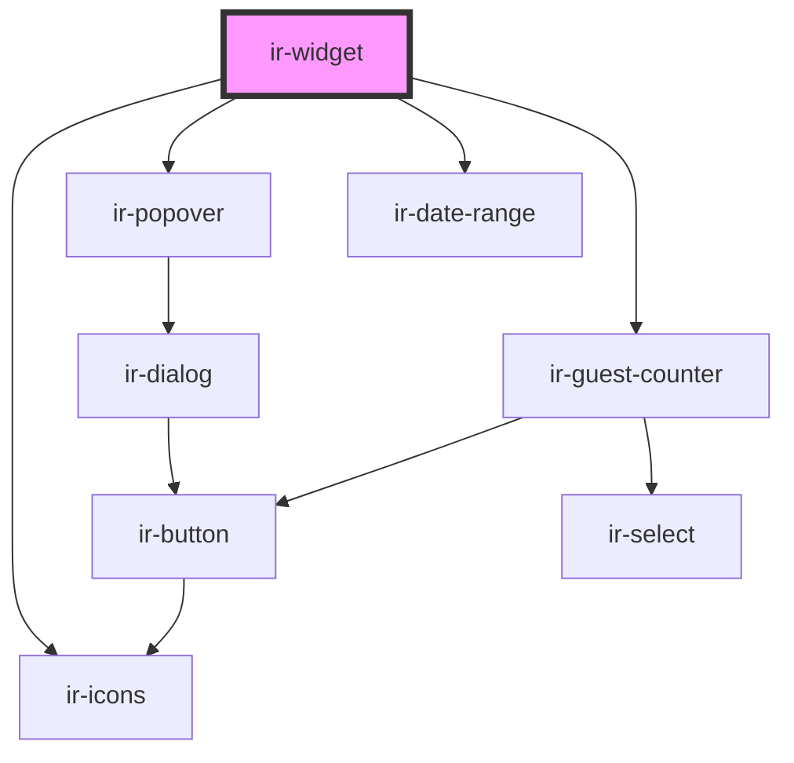

# ir-booking-widget

<!-- Auto Generated Below -->

## Properties

| Property                | Attribute      | Description | Type                                                                                              | Default     |
| ----------------------- | -------------- | ----------- | ------------------------------------------------------------------------------------------------- | ----------- |
| `aff`                   | `aff`          |             | `string`                                                                                          | `null`      |
| `contentContainerStyle` | --             |             | `{ color?: string; height?: string; width?: string; borderColor?: string; background?: string; }` | `undefined` |
| `delay`                 | `delay`        |             | `number`                                                                                          | `300`       |
| `language`              | `language`     |             | `string`                                                                                          | `'en'`      |
| `p`                     | `p`            |             | `string`                                                                                          | `null`      |
| `perma_link`            | `perma_link`   |             | `string`                                                                                          | `null`      |
| `position`              | `position`     |             | `"block" \| "fixed"`                                                                              | `'fixed'`   |
| `propertyId`            | `property-id`  |             | `number`                                                                                          | `42`        |
| `roomTypeId`            | `room-type-id` |             | `string`                                                                                          | `null`      |

## Dependencies

### Depends on

- [ir-icons](../ui/ir-icons)
- [ir-popover](../ui/ir-popover)
- [ir-date-range](../ui/ir-date-range)
- [ir-guest-counter](../ir-guest-counter)

### Graph

----------------------------------------------

*Built with [StencilJS](https://stenciljs.com/)*
