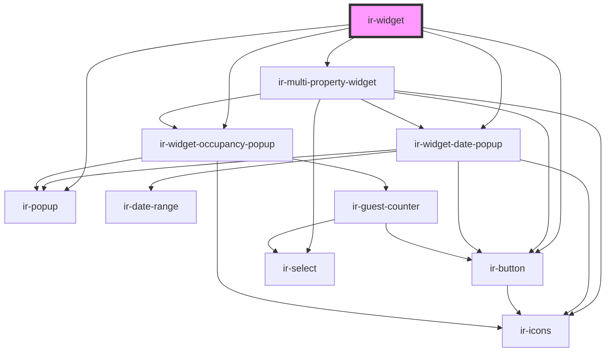

# ir-booking-widget

<!-- Auto Generated Below -->

## Properties

| Property     | Attribute      | Description | Type                 | Default     |
| ------------ | -------------- | ----------- | -------------------- | ----------- |
| `aff`        | `aff`          |             | `string`             | `null`      |
| `delay`      | `delay`        |             | `number`             | `300`       |
| `l`          | `l`            |             | `string`             | `undefined` |
| `language`   | `language`     |             | `string`             | `'en'`      |
| `p`          | `p`            |             | `string`             | `null`      |
| `perma_link` | `perma_link`   |             | `string`             | `null`      |
| `pool`       | `pool`         |             | `string`             | `undefined` |
| `position`   | `position`     |             | `"block" \| "fixed"` | `'fixed'`   |
| `propertyId` | `property-id`  |             | `number`             | `42`        |
| `roomTypeId` | `room-type-id` |             | `string`             | `null`      |

## Shadow Parts

| Part                | Description |
| ------------------- | ----------- |
| `"anchor"`          |             |
| `"container"`       |             |
| `"cta"`             |             |
| `"header"`          |             |
| `"hover"`           |             |
| `"property-select"` |             |

## Dependencies

### Depends on

- [ir-multi-property-widget](ir-multi-property-widget)
- [ir-popup](../ui/ir-popup)
- [ir-button](../ui/ir-button)
- [ir-widget-date-popup](ir-widget-date-popup)
- [ir-widget-occupancy-popup](ir-widget-occupancy-popup)

### Graph

----------------------------------------------

*Built with [StencilJS](https://stenciljs.com/)*
