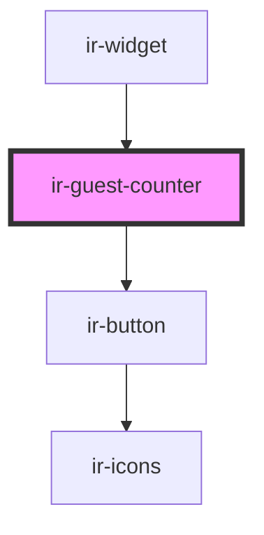

# ir-guest-counter

<!-- Auto Generated Below -->

## Properties

| Property           | Attribute            | Description | Type     | Default     |
| ------------------ | -------------------- | ----------- | -------- | ----------- |
| `adults`           | `adults`             |             | `number` | `undefined` |
| `child`            | `child`              |             | `number` | `undefined` |
| `childMaxAge`      | `child-max-age`      |             | `number` | `17`        |
| `maxAdultCount`    | `max-adult-count`    |             | `number` | `5`         |
| `maxChildrenCount` | `max-children-count` |             | `number` | `5`         |
| `minAdultCount`    | `min-adult-count`    |             | `number` | `1`         |
| `minChildrenCount` | `min-children-count` |             | `number` | `0`         |

## Events

| Event               | Description | Type               |
| ------------------- | ----------- | ------------------ |
| `closeGuestCounter` |             | `CustomEvent<any>` |
| `updateCounts`      |             | `CustomEvent<any>` |

## Dependencies

### Used by

 - [ir-widget](../ir-booking-widget)

### Depends on

- [ir-button](../ui/ir-button)

### Graph

----------------------------------------------

*Built with [StencilJS](https://stenciljs.com/)*
