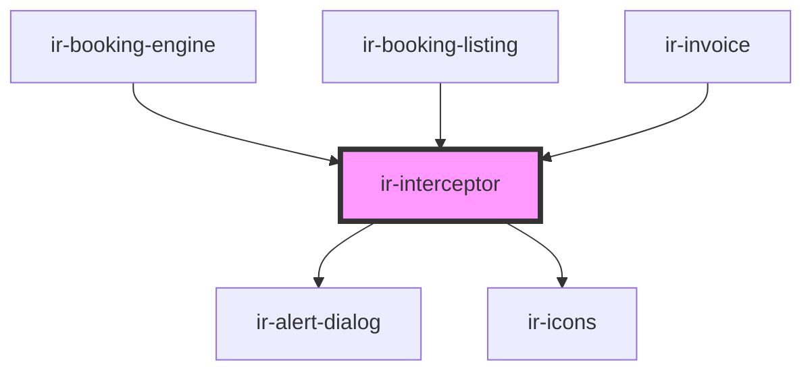

# ir-interceptor

<!-- Auto Generated Below -->

## Properties

| Property           | Attribute | Description | Type       | Default                                                                |
| ------------------ | --------- | ----------- | ---------- | ---------------------------------------------------------------------- |
| `handledEndpoints` | --        |             | `string[]` | `['/ReAllocate_Exposed_Room', '/Do_Payment', '/Get_Exposed_Bookings']` |

## Dependencies

### Used by

 - [ir-booking-engine](../ir-booking-engine)
 - [ir-booking-listing](../ir-booking-engine/ir-booking-listing)
 - [ir-invoice](../ir-invoice)

### Depends on

- [ir-alert-dialog](../ui/ir-alert-dialog)
- [ir-icons](../ui/ir-icons)

### Graph

----------------------------------------------

*Built with [StencilJS](https://stenciljs.com/)*
