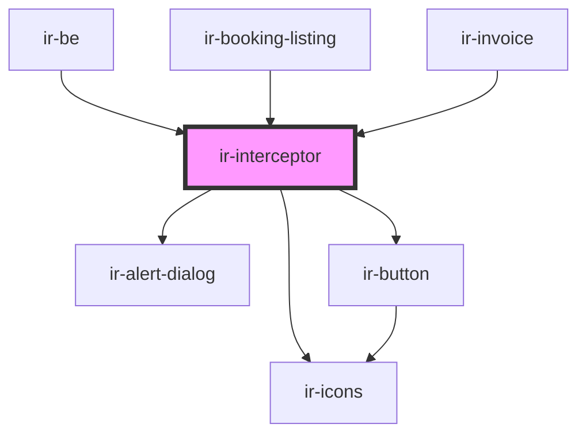

# ir-interceptor

<!-- Auto Generated Below -->

## Properties

| Property           | Attribute | Description | Type    | Default |
| ------------------ | --------- | ----------- | ------- | ------- |
| `handledEndpoints` | --        |             | `any[]` | `[]`    |

## Dependencies

### Used by

 - [ir-be](../ir-booking-engine)
 - [ir-booking-listing](../ir-booking-engine/ir-booking-listing)
 - [ir-invoice](../ir-invoice)

### Depends on

- [ir-alert-dialog](../ui/ir-alert-dialog)
- [ir-icons](../ui/ir-icons)
- [ir-button](../ui/ir-button)

### Graph

----------------------------------------------

*Built with [StencilJS](https://stenciljs.com/)*
