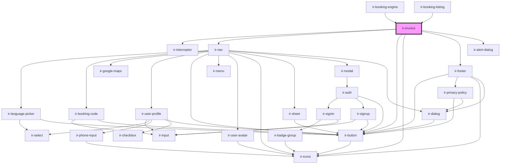

# ir-invoice

<!-- Auto Generated Below -->

## Properties

| Property        | Attribute        | Description | Type      | Default     |
| --------------- | ---------------- | ----------- | --------- | ----------- |
| `aName`         | `a-name`         |             | `string`  | `null`      |
| `baseUrl`       | `base-url`       |             | `string`  | `undefined` |
| `be`            | `be`             |             | `boolean` | `false`     |
| `bookingNbr`    | `booking-nbr`    |             | `string`  | `undefined` |
| `email`         | `email`          |             | `string`  | `undefined` |
| `footerShown`   | `footer-shown`   |             | `boolean` | `true`      |
| `headerShown`   | `header-shown`   |             | `boolean` | `true`      |
| `language`      | `language`       |             | `string`  | `'en'`      |
| `locationShown` | `location-shown` |             | `boolean` | `true`      |
| `perma_link`    | `perma_link`     |             | `string`  | `null`      |
| `propertyId`    | `property-id`    |             | `number`  | `undefined` |
| `status`        | `status`         |             | `0 \| 1`  | `1`         |

## Dependencies

### Used by

 - [ir-booking-engine](../ir-booking-engine)
 - [ir-booking-listing](../ir-booking-engine/ir-booking-listing)

### Depends on

- [ir-interceptor](../ir-interceptor)
- [ir-nav](../ir-booking-engine/ir-nav)
- [ir-button](../ui/ir-button)
- [ir-icons](../ui/ir-icons)
- [ir-footer](../ir-booking-engine/ir-footer)
- [ir-alert-dialog](../ui/ir-alert-dialog)

### Graph

----------------------------------------------

*Built with [StencilJS](https://stenciljs.com/)*
