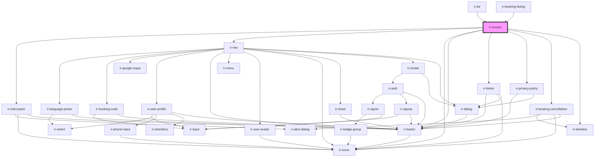

# ir-invoice

<!-- Auto Generated Below -->

## Properties

| Property             | Attribute              | Description | Type      | Default                                 |
| -------------------- | ---------------------- | ----------- | --------- | --------------------------------------- |
| `aName`              | `a-name`               |             | `string`  | `null`                                  |
| `baseUrl`            | `base-url`             |             | `string`  | `'https://gateway.igloorooms.com/IRBE'` |
| `be`                 | `be`                   |             | `boolean` | `false`                                 |
| `bookingNbr`         | `booking-nbr`          |             | `string`  | `undefined`                             |
| `email`              | `email`                |             | `string`  | `undefined`                             |
| `footerShown`        | `footer-shown`         |             | `boolean` | `true`                                  |
| `headerMessageShown` | `header-message-shown` |             | `boolean` | `true`                                  |
| `headerShown`        | `header-shown`         |             | `boolean` | `true`                                  |
| `isConfermation`     | `is-confermation`      |             | `boolean` | `true`                                  |
| `language`           | `language`             |             | `string`  | `undefined`                             |
| `locationShown`      | `location-shown`       |             | `boolean` | `true`                                  |
| `perma_link`         | `perma_link`           |             | `string`  | `null`                                  |
| `propertyId`         | `property-id`          |             | `number`  | `undefined`                             |
| `status`             | `status`               |             | `0 \| 1`  | `1`                                     |
| `version`            | `version`              |             | `string`  | `'2.0'`                                 |

## Dependencies

### Used by

 - [ir-be](../ir-booking-engine)
 - [ir-booking-listing](../ir-booking-engine/ir-booking-listing)

### Depends on

- [ir-interceptor](../ir-interceptor)
- [ir-nav](../ir-booking-engine/ir-nav)
- [ir-icons](../ui/ir-icons)
- [ir-button](../ui/ir-button)
- [ir-footer](../ir-booking-engine/ir-footer)
- [ir-privacy-policy](../ir-booking-engine/ir-privacy-policy)
- [ir-booking-cancellation](../ir-booking-cancellation)
- [ir-skeleton](../ui/ir-skeleton)

### Graph

----------------------------------------------

*Built with [StencilJS](https://stenciljs.com/)*
