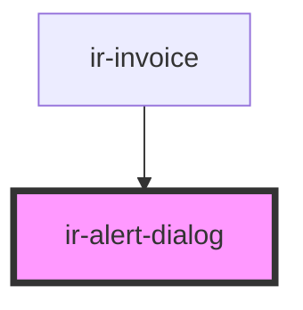

# ir-alert-dialog

<!-- Auto Generated Below -->

## Methods

### `closeModal() => Promise<void>`

#### Returns

Type: `Promise<void>`

### `openModal() => Promise<void>`

#### Returns

Type: `Promise<void>`

## Dependencies

### Used by

 - [ir-invoice](../../ir-invoice)

### Graph

----------------------------------------------

*Built with [StencilJS](https://stenciljs.com/)*
