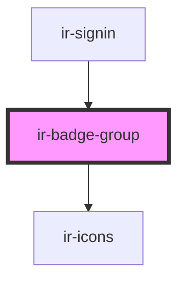

# ir-badge-group

<!-- Auto Generated Below -->

## Properties

| Property          | Attribute          | Description | Type                                              | Default     |
| ----------------- | ------------------ | ----------- | ------------------------------------------------- | ----------- |
| `badge`           | `badge`            |             | `string`                                          | `''`        |
| `clickable`       | `clickable`        |             | `boolean`                                         | `undefined` |
| `message`         | `message`          |             | `string`                                          | `''`        |
| `messagePosition` | `message-position` |             | `"center" \| "default"`                           | `'default'` |
| `variant`         | `variant`          |             | `"error" \| "primary" \| "secondary" \| "succes"` | `'primary'` |

## Events

| Event        | Description | Type                      |
| ------------ | ----------- | ------------------------- |
| `badgeClick` |             | `CustomEvent<MouseEvent>` |

## Dependencies

### Used by

 - [ir-signin](../../ir-booking-engine/ir-nav/ir-auth/ir-signin)

### Depends on

- [ir-icons](../ir-icons)

### Graph

----------------------------------------------

*Built with [StencilJS](https://stenciljs.com/)*
