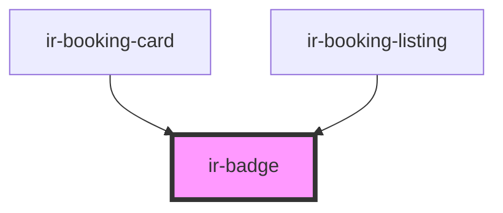

# ir-badge

<!-- Auto Generated Below -->

## Properties

| Property          | Attribute          | Description | Type                                             | Default     |
| ----------------- | ------------------ | ----------- | ------------------------------------------------ | ----------- |
| `backgroundShown` | `background-shown` |             | `boolean`                                        | `true`      |
| `label`           | `label`            |             | `string`                                         | `undefined` |
| `size`            | `size`             |             | `"lg" \| "md" \| "sm"`                           | `'sm'`      |
| `variant`         | `variant`          |             | `"default" \| "error" \| "pending" \| "success"` | `'default'` |
| `withDot`         | `with-dot`         |             | `""`                                             | `undefined` |

## Dependencies

### Used by

 - [ir-booking-card](../../ir-booking-engine/ir-booking-listing/ir-booking-card)
 - [ir-booking-listing](../../ir-booking-engine/ir-booking-listing)

### Graph

----------------------------------------------

*Built with [StencilJS](https://stenciljs.com/)*
