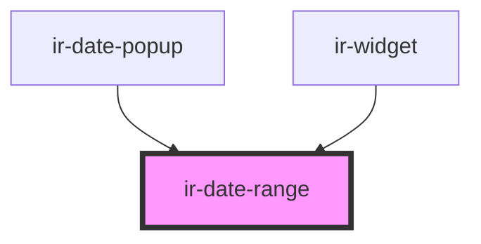

# ir-date-range

<!-- Auto Generated Below -->

## Properties

| Property        | Attribute       | Description | Type             | Default                     |
| --------------- | --------------- | ----------- | ---------------- | --------------------------- |
| `dateModifiers` | --              |             | `IDateModifiers` | `undefined`                 |
| `fromDate`      | --              |             | `Date`           | `null`                      |
| `locale`        | --              |             | `Locale`         | `enUS`                      |
| `maxDate`       | --              |             | `Date`           | `addYears(new Date(), 24)`  |
| `maxSpanDays`   | `max-span-days` |             | `number`         | `90`                        |
| `minDate`       | --              |             | `Date`           | `addYears(new Date(), -24)` |
| `showPrice`     | `show-price`    |             | `boolean`        | `false`                     |
| `toDate`        | --              |             | `Date`           | `null`                      |

## Events

| Event        | Description | Type                                       |
| ------------ | ----------- | ------------------------------------------ |
| `dateChange` |             | `CustomEvent<{ start: Date; end: Date; }>` |

## Dependencies

### Used by

 - [ir-date-popup](../../ir-booking-engine/ir-booking-page/ir-availibility-header/ir-date-popup)
 - [ir-widget](../../ir-booking-widget)

### Graph

----------------------------------------------

*Built with [StencilJS](https://stenciljs.com/)*
