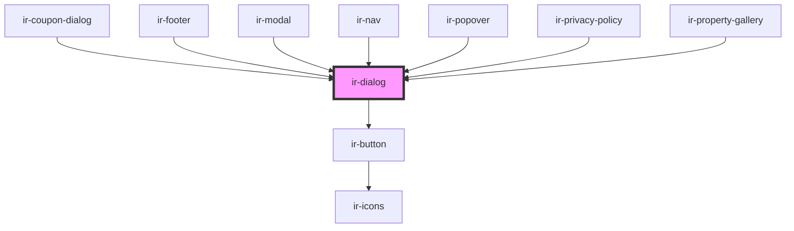

# ir-dialog

<!-- Auto Generated Below -->

## Properties

| Property      | Attribute      | Description | Type      | Default |
| ------------- | -------------- | ----------- | --------- | ------- |
| `closeButton` | `close-button` |             | `boolean` | `true`  |

## Events

| Event        | Description | Type                   |
| ------------ | ----------- | ---------------------- |
| `openChange` |             | `CustomEvent<boolean>` |

## Methods

### `closeModal() => Promise<void>`

#### Returns

Type: `Promise<void>`

### `openModal() => Promise<void>`

#### Returns

Type: `Promise<void>`

## Dependencies

### Used by

 - [ir-coupon-dialog](../../ir-booking-engine/ir-booking-page/ir-availability-header/ir-coupon-dialog)
 - [ir-footer](../../ir-booking-engine/ir-footer)
 - [ir-modal](../ir-modal)
 - [ir-nav](../../ir-booking-engine/ir-nav)
 - [ir-popover](../ir-popover)
 - [ir-privacy-policy](../../ir-booking-engine/ir-privacy-policy)
 - [ir-property-gallery](../../ir-booking-engine/ir-booking-page/ir-property-gallery)

### Depends on

- [ir-button](../ir-button)

### Graph

----------------------------------------------

*Built with [StencilJS](https://stenciljs.com/)*
