# ir-icons

<!-- Auto Generated Below -->

## Properties

| Property          | Attribute           | Description | Type                                                                                                                                                                                                                                                                                                                                                                                                                                                                                                                                                                                                                                                                                                                  | Default     |
| ----------------- | ------------------- | ----------- | --------------------------------------------------------------------------------------------------------------------------------------------------------------------------------------------------------------------------------------------------------------------------------------------------------------------------------------------------------------------------------------------------------------------------------------------------------------------------------------------------------------------------------------------------------------------------------------------------------------------------------------------------------------------------------------------------------------------- | ----------- |
| `height`          | `height`            |             | `number`                                                                                                                                                                                                                                                                                                                                                                                                                                                                                                                                                                                                                                                                                                              | `undefined` |
| `name`            | `name`              |             | `"image" \| "search" \| "user" \| "clock" \| "wifi" \| "car" \| "pets" \| "bed" \| "hotel" \| "utencils" \| "credit_card" \| "check" \| "danger" \| "bell" \| "football" \| "burger_menu" \| "home" \| "xmark" \| "snowflake" \| "sun" \| "minus" \| "heart" \| "dimensions" \| "user_group" \| "smoking" \| "ban_smoking" \| "double_bed" \| "arrow_right" \| "arrow_left" \| "circle_info" \| "calendar" \| "child" \| "globe" \| "facebook" \| "twitter" \| "whatsapp" \| "instagram" \| "youtube" \| "angle_left" \| "angle_right" \| "coupon" \| "location_dot" \| "plus" \| "elipse_vertical" \| "taxi" \| "angle_down" \| "angle_up" \| "ellipsis" \| "arrow-up-right-from-square" \| "circle-user" \| "baby"` | `undefined` |
| `removeClassName` | `remove-class-name` |             | `boolean`                                                                                                                                                                                                                                                                                                                                                                                                                                                                                                                                                                                                                                                                                                             | `undefined` |
| `svgClassName`    | `svg-class-name`    |             | `string`                                                                                                                                                                                                                                                                                                                                                                                                                                                                                                                                                                                                                                                                                                              | `undefined` |
| `width`           | `width`             |             | `number`                                                                                                                                                                                                                                                                                                                                                                                                                                                                                                                                                                                                                                                                                                              | `undefined` |

## Dependencies

### Used by

 - [ir-accomodations](../../ir-booking-engine/ir-booking-page/ir-accomodations)
 - [ir-adult-child-counter](../../ir-booking-engine/ir-booking-page/ir-adult-child-counter)
 - [ir-badge-group](../ir-badge-group)
 - [ir-booking-cancellation](../../ir-booking-cancellation)
 - [ir-booking-details](../../ir-booking-engine/ir-checkout-page/ir-booking-details)
 - [ir-booking-details-view](../../ir-booking-engine/ir-booking-listing/ir-booking-details-view)
 - [ir-button](../ir-button)
 - [ir-coupon-dialog](../../ir-booking-engine/ir-booking-page/ir-availability-header/ir-coupon-dialog)
 - [ir-date-popup](../../ir-booking-engine/ir-booking-page/ir-availability-header/ir-date-popup)
 - [ir-facilities](../../ir-booking-engine/ir-booking-page/ir-facilities)
 - [ir-footer](../../ir-booking-engine/ir-footer)
 - [ir-interceptor](../../ir-interceptor)
 - [ir-invoice](../../ir-invoice)
 - [ir-loyalty](../../ir-booking-engine/ir-booking-page/ir-availability-header/ir-loyalty)
 - [ir-nav](../../ir-booking-engine/ir-nav)
 - [ir-pagination](../../ir-booking-engine/ir-booking-listing/ir-pagination)
 - [ir-phone-input](../ir-phone-input)
 - [ir-pickup](../../ir-booking-engine/ir-checkout-page/ir-pickup)
 - [ir-property-gallery](../../ir-booking-engine/ir-booking-page/ir-property-gallery)
 - [ir-quick-auth](../../ir-booking-engine/ir-checkout-page/ir-user-form/ir-quick-auth)
 - [ir-room-type-amenities](../../ir-booking-engine/ir-booking-page/ir-room-type-amenities)
 - [ir-user-avatar](../../ir-booking-engine/ir-nav/ir-user-profile/ir-user-avatar)
 - [ir-widget](../../ir-booking-widget)

### Graph

```mermaid
graph TD;
  ir-accomodations --> ir-icons
  ir-adult-child-counter --> ir-icons
  ir-badge-group --> ir-icons
  ir-booking-cancellation --> ir-icons
  ir-booking-details --> ir-icons
  ir-booking-details-view --> ir-icons
  ir-button --> ir-icons
  ir-coupon-dialog --> ir-icons
  ir-date-popup --> ir-icons
  ir-facilities --> ir-icons
  ir-footer --> ir-icons
  ir-interceptor --> ir-icons
  ir-invoice --> ir-icons
  ir-loyalty --> ir-icons
  ir-nav --> ir-icons
  ir-pagination --> ir-icons
  ir-phone-input --> ir-icons
  ir-pickup --> ir-icons
  ir-property-gallery --> ir-icons
  ir-quick-auth --> ir-icons
  ir-room-type-amenities --> ir-icons
  ir-user-avatar --> ir-icons
  ir-widget --> ir-icons
  style ir-icons fill:#f9f,stroke:#333,stroke-width:4px
```

----------------------------------------------

*Built with [StencilJS](https://stenciljs.com/)*
