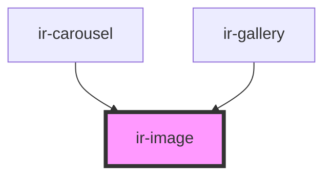

# ir-image

<!-- Auto Generated Below -->

## Properties

| Property    | Attribute   | Description | Type     | Default     |
| ----------- | ----------- | ----------- | -------- | ----------- |
| `alt`       | `alt`       |             | `string` | `undefined` |
| `blurhash`  | `blurhash`  |             | `string` | `undefined` |
| `height`    | `height`    |             | `number` | `32`        |
| `src`       | `src`       |             | `string` | `undefined` |
| `thumbnail` | `thumbnail` |             | `string` | `undefined` |
| `width`     | `width`     |             | `number` | `32`        |

## Dependencies

### Used by

 - [ir-carousel](../ir-carousel)
 - [ir-gallery](../ir-gallery)

### Graph

----------------------------------------------

*Built with [StencilJS](https://stenciljs.com/)*
